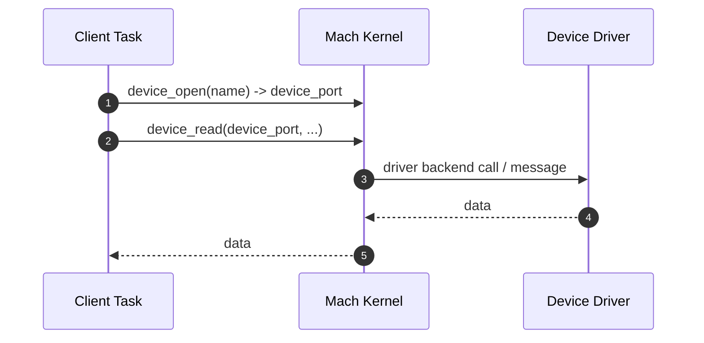
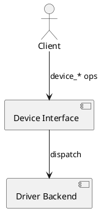

# Device Interface

Devices are accessed via device ports using the Mach device interface (open, close, read, write, map, status, filter).

## Common Operations
- device_open/device_close
- device_read/device_write
- device_map: map device memory into task address space
- device_get_status/device_set_status
- device_set_filter

## Access Flow (Mermaid Sequence)

## Components (PlantUML)

Note: Depending on configuration, drivers may be in-kernel or proxied to user-space servers.

## References
- Device Interface: `https://www.gnu.org/software/hurd/gnumach-doc/Device-Interface.html`
- Device Open/Close: `https://www.gnu.org/software/hurd/gnumach-doc/Device-Open.html`, `https://www.gnu.org/software/hurd/gnumach-doc/Device-Close.html`
- Device Read/Write/Map/Status/Filter: `https://www.gnu.org/software/hurd/gnumach-doc/Device-Read.html`, `https://www.gnu.org/software/hurd/gnumach-doc/Device-Write.html`, `https://www.gnu.org/software/hurd/gnumach-doc/Device-Map.html`, `https://www.gnu.org/software/hurd/gnumach-doc/Device-Status.html`, `https://www.gnu.org/software/hurd/gnumach-doc/Device-Filter.html`
