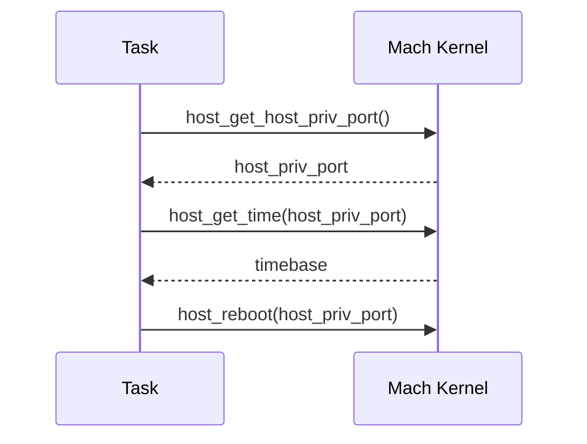
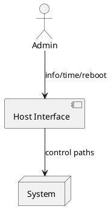

# Host Interface

Operations for system-wide control and information, exposed via host ports.

## Host Operations
- host_information: CPU/memory stats, scheduling info.
- host_get_time / host_set_time.
- host_reboot.
- host-ports discovery and capabilities.

## Example Interactions (Mermaid)

## Components (PlantUML)

## References
- Host Interface: `https://www.gnu.org/software/hurd/gnumach-doc/Host-Interface.html`
- Host Ports/Info/Time/Reboot: `https://www.gnu.org/software/hurd/gnumach-doc/Host-Ports.html`, `https://www.gnu.org/software/hurd/gnumach-doc/Host-Information.html`, `https://www.gnu.org/software/hurd/gnumach-doc/Host-Time.html`, `https://www.gnu.org/software/hurd/gnumach-doc/Host-Reboot.html`
