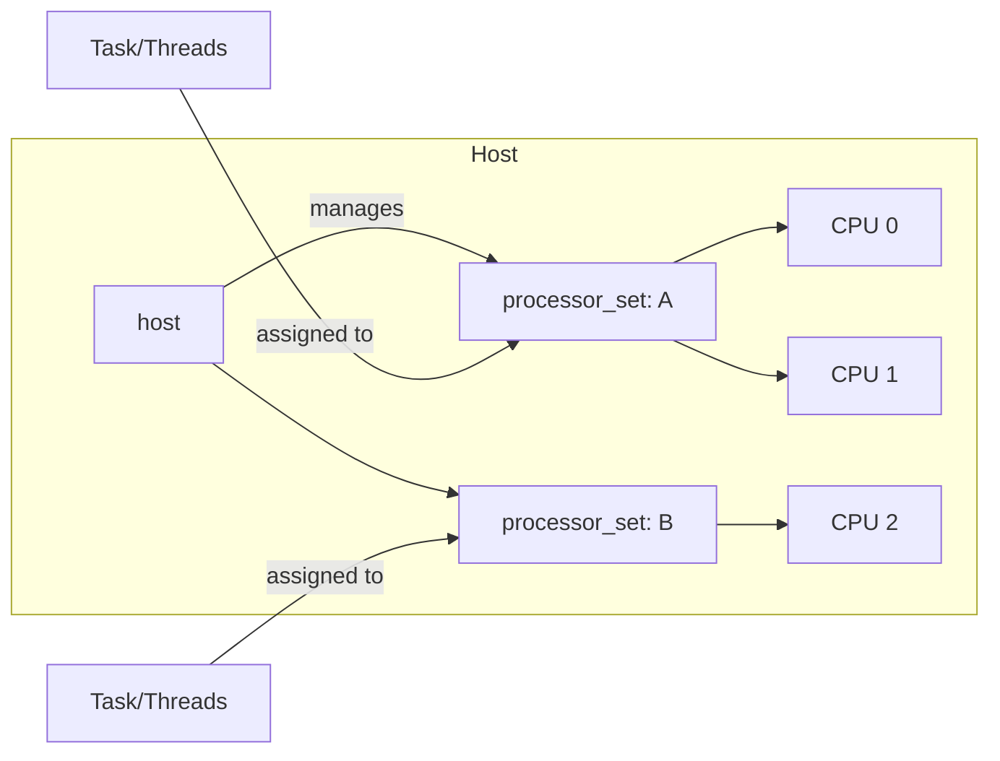
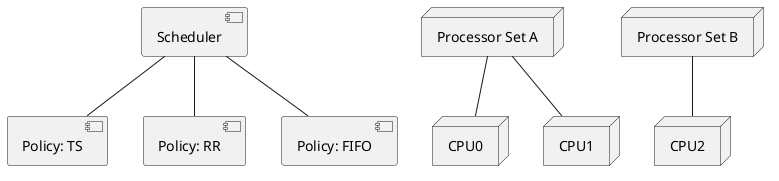

# Scheduling and Processor Sets

GNU Mach supports multiple policies and processor set partitioning for scalability and isolation.

## Scheduling Policies
- Time-sharing (TS): dynamic priorities.
- Round-robin (RR): fixed timeslice rotation.
- First-in, first-out (FIFO): run-to-block with fixed priority.
- Hand-off scheduling: transfer CPU directly on IPC rendezvous in special cases.

## Processor Sets (Mermaid)

## Components and Control (PlantUML)

## References
- Scheduling: `https://www.gnu.org/software/hurd/gnumach-doc/Scheduling.html`
- Hand-Off Scheduling: `https://www.gnu.org/software/hurd/gnumach-doc/Hand_002dOff-Scheduling.html`
- Scheduling Policy: `https://www.gnu.org/software/hurd/gnumach-doc/Scheduling-Policy.html`
- Processor Sets: `https://www.gnu.org/software/hurd/gnumach-doc/Processors-and-Processor-Sets.html`
- Processor/Set Interfaces: `https://www.gnu.org/software/hurd/gnumach-doc/Processor-Set-Interface.html`, `https://www.gnu.org/software/hurd/gnumach-doc/Processor-Interface.html`
