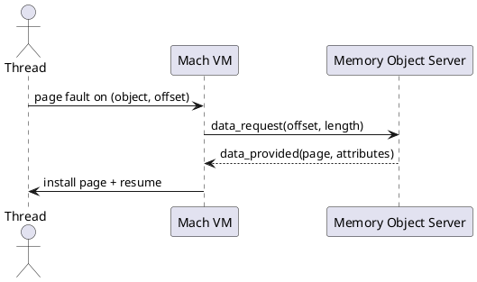

# Virtual Memory

GNU Mach provides a flexible VM system backed by memory objects that may be served by in-kernel or user-space pagers.

## Primitives
- Address Space (per Task): regions mapped with protections/attributes.
- Memory Objects: abstract backing store; served by a pager (e.g., default memory manager or external server).
- Operations: `vm_allocate`, `vm_deallocate`, `vm_protect`, `vm_inherit`, `vm_map`, `vm_copy`, `vm_read`, `vm_write`.

## Mapping and Fault Handling (Mermaid)
```mermaid
flowchart TD
  A[Task thread accesses VA] --> B{Mapping present?}
  B -- yes --> C[Access check & proceed]
  B -- no/page invalid --> D[Page Fault]
  D --> E[VM resolves: object, offset, protections]
  E --> F{Resident page?}
  F -- yes --> G[Install mapping, resume]
  F -- no --> H[Request from pager (memory_object_data_request)]
  H --> I[Pager supplies page (data_provided)]
  I --> G
```

## Pager Interaction (PlantUML Sequence)


## Attributes and Copying
- Copy-on-write via object shadow chains.
- Attributes: caching, copy strategy, clustering, inheritance.
- Statistics and introspection available via VM info interfaces.

## References
- Virtual Memory Interface: `https://www.gnu.org/software/hurd/gnumach-doc/Virtual-Memory-Interface.html`
- Memory Objects and Data: `https://www.gnu.org/software/hurd/gnumach-doc/Memory-Objects-and-Data.html`
- Mapping Memory Objects: `https://www.gnu.org/software/hurd/gnumach-doc/Mapping-Memory-Objects.html`
- Memory Attributes/Statistics: `https://www.gnu.org/software/hurd/gnumach-doc/Memory-Attributes.html`, `https://www.gnu.org/software/hurd/gnumach-doc/Memory-Statistics.html`
