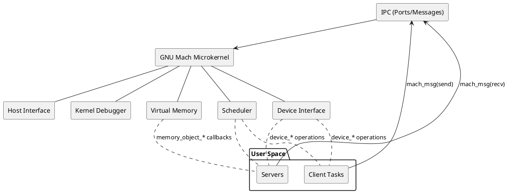

# GNU Mach Architecture Overview

This overview connects the major subsystems of the GNU Mach microkernel: tasks/threads, IPC/ports, virtual memory, scheduling/processor sets, device interface, host interface, bootstrap, and debugging.

- Microkernel responsibilities: IPC, VM, scheduling, basic devices, timing, and host control.
- User space responsibilities: servers (e.g., filesystems, network stacks) and applications built atop IPC.

## High-Level System Map
```mermaid
graph TB
  subgraph User_Space[User Space]
    A[Tasks (clients)]
    S[Servers (Hurd translators, pagers, etc.)]
  end

  subgraph Kernel[GNU Mach Microkernel]
    IPC[IPC: Ports & Messages]
    VM[Virtual Memory]
    SCHED[Scheduler]
    DEV[Device Interface]
    HOST[Host Interface]
    KDB[Kernel Debugger]
  end

  A -- mach_msg() over send rights --> IPC
  S -- mach_msg() over receive rights --> IPC

  IPC --> VM
  IPC --> DEV
  SCHED --> A
  SCHED --> S

  DEV ---|device ports| A
  DEV ---|device ports| S
  VM ---|memory objects| S
  HOST --- A
  HOST --- S

  BOOT[Boot/Bootstrap] --> Kernel
  Kernel --> BT[Bootstrap Task & Ports]
```

## Component Relationships (PlantUML)


## Notes
- Ports mediate all capabilities: a port right (send/receive/send-once) is required to communicate or control a resource.
- VM integrates with external pagers via memory objects and the default memory manager.
- Scheduling is policy-driven and can be scoped to processor sets.
- Devices are accessed through device ports; implementations may reside in-kernel or be proxied to user-space drivers, depending on configuration.

## References
- Overview: `https://www.gnu.org/software/hurd/gnumach-doc/Overview.html`
- Features: `https://www.gnu.org/software/hurd/gnumach-doc/Features.html`
- Major Concepts: `https://www.gnu.org/software/hurd/gnumach-doc/Major-Concepts.html`
