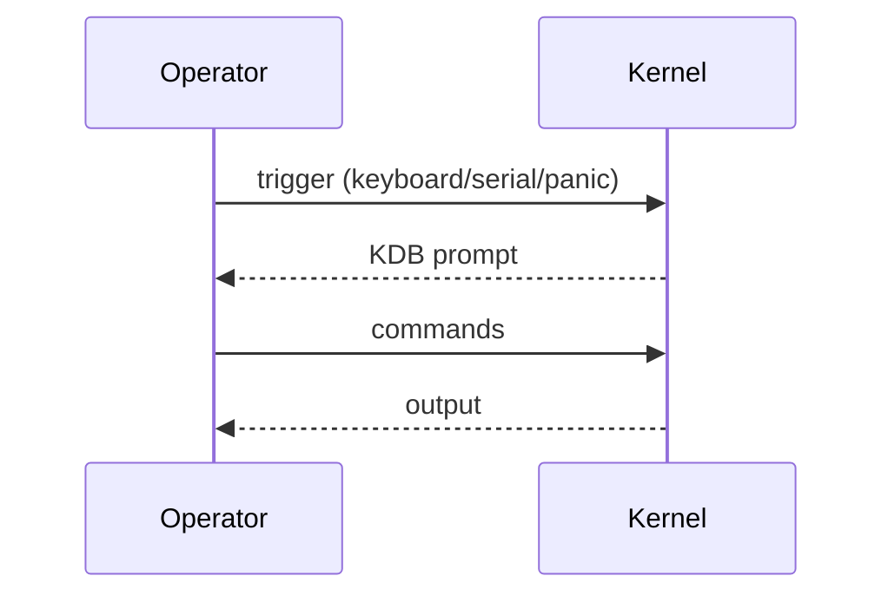

# Kernel Debugger and Profiling

GNU Mach includes a built-in kernel debugger and profiling support.

## Kernel Debugger
- Commands: inspect state, memory, ports, threads, tasks.
- Variables/expressions and command scripting.
- Can be entered via key sequence, panic, or explicit triggers.

### Enter/Exit Flow (Mermaid)

## Profiling
- Collect scheduling and VM events for analysis.
- Profiling control via kernel interfaces.

## References
- Kernel Debugger: `https://www.gnu.org/software/hurd/gnumach-doc/Kernel-Debugger.html`
- Commands/Variables/Expressions: `https://www.gnu.org/software/hurd/gnumach-doc/Commands.html`, `https://www.gnu.org/software/hurd/gnumach-doc/Variables.html`, `https://www.gnu.org/software/hurd/gnumach-doc/Expressions.html`
- Profiling: `https://www.gnu.org/software/hurd/gnumach-doc/Profiling.html`
