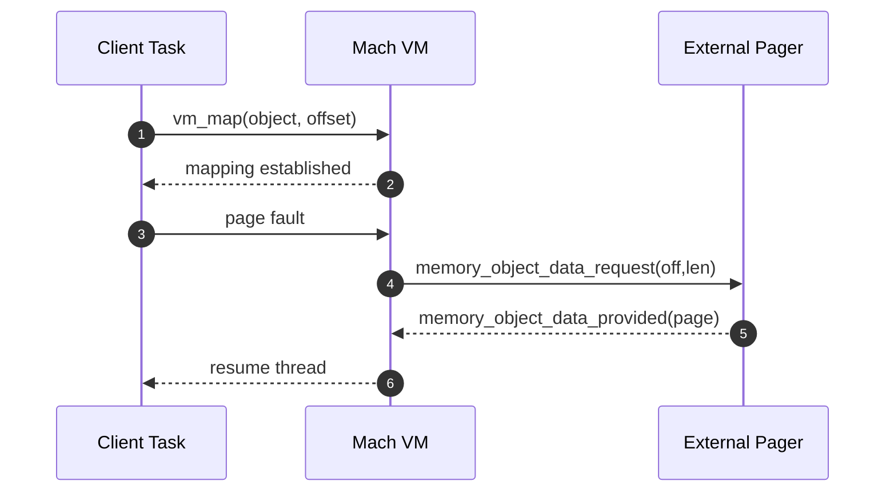
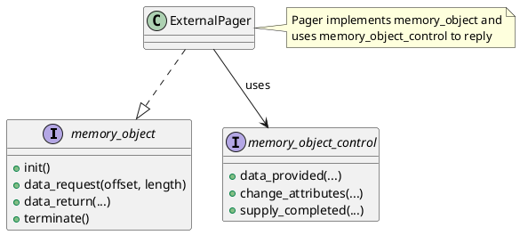

# External Memory Management (EMM)

EMM lets user-space pagers back memory objects, enabling sophisticated policies and distributed storage.

## Roles
- Default Memory Manager (DMM): system pager for anonymous memory; provides default backing.
- External Pager: user task serving a memory object (files, network-backed pages, etc.).
- VM: mediates page faults and enforces protections/attributes.

## Pager Lifecycle (Mermaid)

## Pager Interfaces (PlantUML)

## Copy Strategy and Coherency
- Copy strategies influence how copy-on-write and replication are handled.
- Attribute negotiation occurs via object attribute calls.

## References
- External Memory Management: `https://www.gnu.org/software/hurd/gnumach-doc/External-Memory-Management.html`
- Memory Object Server: `https://www.gnu.org/software/hurd/gnumach-doc/Memory-Object-Server.html`
- Default Memory Manager: `https://www.gnu.org/software/hurd/gnumach-doc/Default-Memory-Manager.html`
