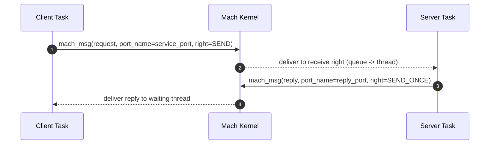
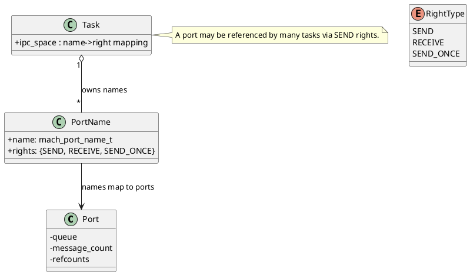

# Inter-Process Communication (IPC)

GNU Mach IPC is capability-based message passing over ports. Port rights govern who may send, receive, or receive a single reply.

## Core Concepts
- Port: kernel-managed message queue and capability endpoint.
- Rights: send, receive, send-once; port sets aggregate receive rights for demultiplexing.
- Messages: typed descriptors with port rights and out-of-line memory.
- Notifications: async events (e.g., dead-name, no-senders) requested by tasks.

## Message Exchange (Mermaid Sequence)

## Port and Rights Model (PlantUML)

## Receive Demultiplexing via Port Sets
- A port set groups multiple receive rights into a single receive queue.
- Servers typically wait on one port set and demux based on message ID.

## Message Format
- Header: destination port, reply port, message ID, size.
- Body: inline data, OOL memory, port descriptors.
- Atomicity: send and receive operations are atomic with respect to the destination port.

## Notifications
- Examples: dead-name, no-senders, send-once notifications.
- Requested by setting notification ports; delivered as normal messages.

## References
- Inter-Process Communication: `https://www.gnu.org/software/hurd/gnumach-doc/Inter-Process-Communication.html`
- Messaging Interface: `https://www.gnu.org/software/hurd/gnumach-doc/Messaging-Interface.html`
- Port Manipulation: `https://www.gnu.org/software/hurd/gnumach-doc/Port-Manipulation-Interface.html`
- Message Send/Receive: `https://www.gnu.org/software/hurd/gnumach-doc/Message-Send.html`, `https://www.gnu.org/software/hurd/gnumach-doc/Message-Receive.html`
- Port Rights and Sets: `https://www.gnu.org/software/hurd/gnumach-doc/Port-Rights.html`, `https://www.gnu.org/software/hurd/gnumach-doc/Port-Sets.html`
