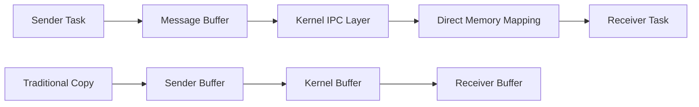
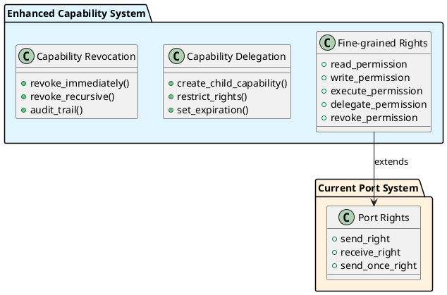

# Mach 5: Next-Generation Microkernel Research

This document outlines research into next-generation Mach concepts, modern microkernel architectures, and prototyping of new IPC mechanisms for GNU Mach.

## Research Objectives

### 1. Evaluate Next-Generation Mach Concepts
- **Capability-based Security**: Enhanced port-based security model
- **Zero-Copy IPC**: Elimination of unnecessary memory copies in message passing
- **Asynchronous IPC**: Non-blocking message passing mechanisms
- **Multicore Scalability**: IPC optimizations for SMP systems
- **Real-time Support**: Predictable message passing latencies

### 2. Prototype New IPC Mechanisms
- **Fast Path IPC**: Optimized common-case message passing
- **Shared Memory IPC**: Direct memory sharing between tasks
- **Vectored IPC**: Efficient handling of scattered/gathered data
- **Notification Channels**: Lightweight event signaling
- **IPC Introspection**: Enhanced debugging and monitoring

### 3. Research Modern Microkernel Architectures
- **seL4**: Formal verification and capability systems
- **Fiasco.OC**: Real-time and multicore support
- **NOVA**: Hardware-assisted virtualization
- **Genode**: Component-based OS architecture
- **Helios**: Distributed microkernel design

## Current GNU Mach IPC Analysis

### Strengths
- Mature and stable message passing interface
- Well-defined port abstraction
- Extensive device driver support through Linux compatibility

### Limitations Identified
1. **Performance**: Multiple memory copies in message passing
2. **Scalability**: Limited SMP optimization in IPC paths
3. **Security**: Basic capability model without fine-grained controls
4. **Real-time**: Non-deterministic message delivery times
5. **Debugging**: Limited introspection capabilities

## Research Areas

### A. Zero-Copy IPC Design

**Objective**: Eliminate memory copies by direct page mapping for large messages.

**Research Questions**:
- How to handle partial page messages efficiently?
- What are the security implications of shared memory IPC?
- How to maintain message atomicity with zero-copy?

### B. Capability Enhancement Research

**Objective**: Enhance the current port-based capability system with fine-grained permissions.

### C. Modern Architecture Comparison

| Feature | GNU Mach | seL4 | Fiasco.OC | NOVA |
|---------|----------|------|-----------|------|
| Formal Verification | No | Yes | Partial | No |
| Real-time Support | Limited | Yes | Yes | Yes |
| SMP Scalability | Basic | Limited | Yes | Yes |
| Hardware Virtualization | Basic | No | Yes | Yes |
| IPC Performance | Moderate | High | High | Very High |

## Prototype Implementation Plan

### Phase 1: IPC Performance Analysis
1. **Benchmarking Framework**
   - Implement IPC latency measurements
   - Memory bandwidth utilization analysis  
   - Scalability testing on multicore systems

2. **Bottleneck Identification**
   - Profile current IPC implementation
   - Identify memory copy overheads
   - Analyze lock contention in SMP scenarios

### Phase 2: Zero-Copy IPC Prototype
1. **Design Requirements**
   - Maintain existing API compatibility
   - Support both small and large messages
   - Ensure security isolation

2. **Implementation Strategy**
   - Page-level sharing for large messages (>4KB)
   - Copy optimization for small messages
   - Reference counting for shared pages

### Phase 3: Enhanced Capabilities
1. **Fine-grained Permissions**
   - Extend port rights with additional attributes
   - Implement capability delegation mechanisms
   - Add revocation and auditing support

2. **Security Analysis**
   - Formal security model definition
   - Vulnerability assessment
   - Performance impact evaluation

## Research Methodology

### 1. Literature Review
- Survey recent microkernel research papers
- Analyze performance comparisons
- Study security model innovations

### 2. Prototype Development
- Implement experimental features in isolated branches
- Maintain compatibility with existing interfaces
- Document design decisions and trade-offs

### 3. Performance Evaluation
- Develop comprehensive benchmark suite
- Compare against current implementation
- Measure impact on real applications

### 4. Security Assessment
- Threat model analysis
- Formal verification where applicable
- Penetration testing of new mechanisms

## Success Metrics

### Performance Goals
- **IPC Latency**: 50% reduction for common cases
- **Memory Bandwidth**: 30% reduction in memory copies
- **SMP Scalability**: Linear scaling up to 8 cores

### Security Goals
- **Capability Model**: Fine-grained permission controls
- **Isolation**: Formal verification of critical paths
- **Audit**: Comprehensive capability usage logging

### Compatibility Goals
- **API Compatibility**: Maintain existing interfaces
- **Application Support**: No changes required for existing software
- **Migration Path**: Gradual adoption of new features

## References

1. Klein, G., et al. "seL4: Formal verification of an OS kernel." SOSP 2009.
2. Liedtke, J. "On micro-kernel construction." SOSP 1995.
3. Steinberg, U., et al. "NOVA: A microhypervisor-based secure virtualization architecture." EuroSys 2010.
4. Lackorzynski, A., et al. "Have your cake and eat it too: Efficiently implementing high-assurance microkernels." RTAS 2007.
5. Feske, N. "A case study on the cost and benefit of dynamic RPC marshalling for low-level system components." EuroSys 2007.

## Implementation Timeline

### Month 1: Research and Analysis
- Literature review completion
- Current system analysis
- Prototype design specification

### Month 2: IPC Prototyping
- Zero-copy IPC implementation
- Performance benchmarking
- Security analysis

### Month 3: Capability Enhancement
- Fine-grained permission system
- Delegation and revocation mechanisms
- Integration testing

### Month 4: Evaluation and Documentation
- Comprehensive performance evaluation
- Security assessment
- Research findings documentation