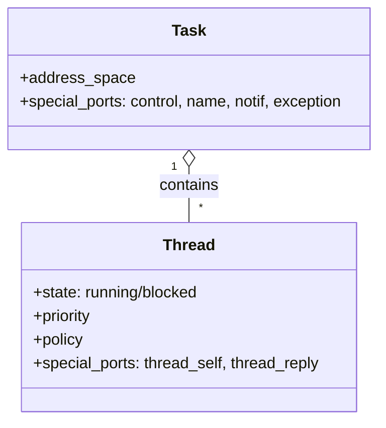
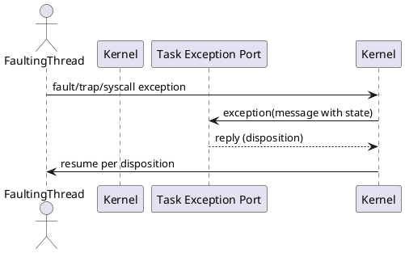

# Threads and Tasks

Tasks encapsulate resources (address space, ports). Threads execute within tasks. Many thread and task operations are exposed via Mach interfaces.

## Structure (Mermaid Class Diagram)

## Interfaces
- Task: creation/termination, info, special ports, execution control.
- Thread: creation/termination, info, settings, execution control, exceptions.
- Exceptions: delivered to task/thread exception ports.

## Exception Delivery (PlantUML Sequence)

## Scheduling Hooks
- Thread priority and policy determine dispatch; see scheduling document.
- Hand-off scheduling can transfer CPU directly on IPC handoff in specific cases.

## References
- Threads and Tasks: `https://www.gnu.org/software/hurd/gnumach-doc/Threads-and-Tasks.html`
- Thread Interface: `https://www.gnu.org/software/hurd/gnumach-doc/Thread-Interface.html`
- Task Interface: `https://www.gnu.org/software/hurd/gnumach-doc/Task-Interface.html`
- Exceptions: `https://www.gnu.org/software/hurd/gnumach-doc/Exceptions.html`
