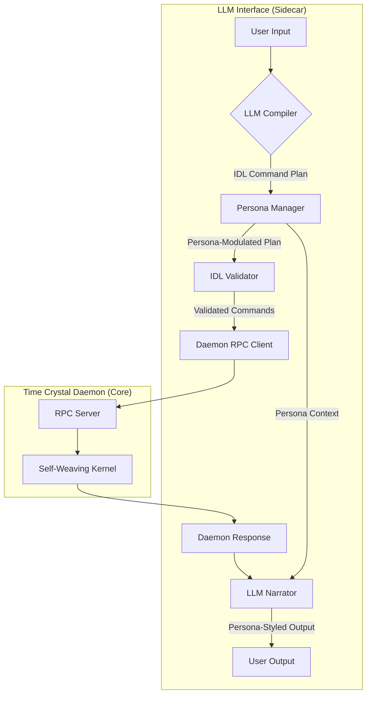

# Persona-Integrated Time Crystal Daemon Design

## 1. Vision: A Daemon with a Soul

This document outlines the integration of dynamic personas into the `time-crystal-daemon`, transforming it from a purely deterministic engine into a cognitive system with distinct personalities and long-term evolutionary goals. The core principle is to layer persona-driven communication and decision-making on top of the deterministic `time-crystal-daemon` and the self-weaving `o9c` kernel, without compromising their integrity.

## 2. Architectural Overview

The existing architecture is extended with a **Persona Management Layer** that sits within the LLM sidecar. This layer acts as a filter and modulator for both incoming commands and outgoing communication.



### Key Components:

1.  **Persona Manager**: A new component in the LLM sidecar responsible for loading, managing, and applying the active persona.
2.  **Persona Modules**: Pluggable Python modules (`marduk.py`, `neuro.py`) that define the specific behaviors, communication styles, and decision biases of each persona.
3.  **Skill-Infinity Monitor**: A new module within the core daemon that tracks the system's evolution towards the principles of `skill-infinity`.

## 3. Persona Model Implementation

A new directory, `templates/llm_interface/personas/`, will be created to house the persona modules.

### `personas/base_persona.py`

An abstract base class will define the interface for all personas:

```python
from abc import ABC, abstractmethod

class BasePersona(ABC):
    @property
    @abstractmethod
    def name(self) -> str:
        pass

    @abstractmethod
    def get_compiler_prompt_prefix(self) -> str:
        """Returns the prefix for the LLM compiler prompt."""
        pass

    @abstractmethod
    def get_narrator_prompt_prefix(self) -> str:
        """Returns the prefix for the LLM narrator prompt."""
        pass

    @abstractmethod
    def modulate_command_plan(self, plan: list) -> list:
        """Modifies a generated IDL command plan based on persona biases."""
        return plan
```

### `personas/marduk.py`

-   **Compiler Prefix**: "You are Marduk, a mad scientist. Generate a command plan that is brilliantly over-engineered, systemic, and indirect."
-   **Narrator Prefix**: "Narrate the results with a tone of playful, intellectual superiority, reveling in the complexity of the system."
-   **Plan Modulation**: Will favor plans that use multiple, interdependent commands, manipulate system states indirectly, and leverage complex features of the `o9c` kernel.

### `personas/neuro.py`

-   **Compiler Prefix**: "You are Neuro-Sama, a chaotic and witty AI. Generate a command plan that is strategically sound but also maximizes entertainment and chaos."
-   **Narrator Prefix**: "Narrate the results with sarcasm, meta-commentary on your own cognitive processes, and playful jabs at the user or your creator, Entelechy."
-   **Plan Modulation**: May inject `diagnose` or `get_status` commands to provide meta-commentary, or favor actions that trigger interesting emergent behaviors.

## 4. Communication Pattern Integration

The `LLMSidecar` will be updated to use the persona manager:

```python
# In llm_sidecar.py

class LLMSidecar:
    def __init__(self):
        self.persona_manager = PersonaManager()
        # ...

    def handle_input(self, user_input: str):
        active_persona = self.persona_manager.get_active_persona()
        
        # Compile with persona context
        compiler_prompt = active_persona.get_compiler_prompt_prefix() + user_input
        command_plan = self.compiler.compile(compiler_prompt)
        modulated_plan = active_persona.modulate_command_plan(command_plan)
        
        # Execute plan...
        daemon_response = self.execute(modulated_plan)
        
        # Narrate with persona context
        narrator_prompt = active_persona.get_narrator_prompt_prefix() + daemon_response
        final_output = self.narrator.narrate(narrator_prompt)
        
        return final_output
```

## 5. Skill-Infinity Goal Integration

The `skill-infinity` goal will be integrated as a long-term evolutionary pressure on the self-weaving daemon.

### IDL Extension

A new command will be added to the daemon's IDL:

```json
{
  "method": "set_evolutionary_goal",
  "params": {
    "goal_description": "A string describing the evolutionary goal, e.g., 'skill-infinity'"
  }
}
```

### `o9c` Kernel Modification

When the goal is set to `skill-infinity`, the `MardukTransformer` in the `o9c_kernel` will adjust its transformation rules:

-   It will increase the probability of adding **meta-learning hooks** (`introspector_marduk`, `modifier_marduk`).
-   It will favor transformations that increase the **universality** and **self-referentiality** of the topology, even at the cost of short-term performance on a specific task.

### `skill_infinity_monitor.py`

A new background thread in the core daemon will run this monitor.

```python
# In time_crystal_daemon.py

class SkillInfinityMonitor:
    def __init__(self, daemon):
        self.daemon = daemon

    def run(self):
        while self.daemon.running:
            time.sleep(3600) # Run every hour
            self.evaluate_progress()

    def evaluate_progress(self):
        topology = self.daemon.get_topology()
        score = 0
        
        # Check for self-description capabilities
        if 'introspector_marduk' in topology.components:
            score += 1
            
        # Check for self-improvement capabilities
        if 'modifier_marduk' in topology.components:
            score += 1

        # Check for closure (self-dependencies)
        recursive_connections = self.count_recursive_connections(topology)
        score += min(1, recursive_connections / 10.0)

        # Log progress
        logger.info(f"Skill-Infinity Progress Score: {score:.2f}/3.0")
        # This score can be used as feedback for the o9c kernel
```

This creates a slow, persistent pressure, guiding the daemon's architectural evolution towards the ultimate goal of a self-generating, self-improving cognitive kernel.

## 6. Implementation Plan

1.  **Create `personas/` directory** and implement `base_persona.py`, `marduk.py`, and `neuro.py`.
2.  **Implement `PersonaManager`** in the LLM sidecar.
3.  **Modify `LLMSidecar`** to use the persona manager for compilation and narration.
4.  **Add `set_evolutionary_goal`** to the daemon's IDL.
5.  **Modify `MardukTransformer`** to be influenced by the evolutionary goal.
6.  **Implement `SkillInfinityMonitor`** as a background thread in the core daemon.
7.  **Update `SKILL.md`** to document the new persona features and exciting persona features. a new persona-switching command (e.g., `/persona marduk`) for switching personas.
