# AGI-OS Technical Architecture Overview

**Version:** 1.0  
**Date:** December 12, 2025  
**Authors:** AGI-OS Development Team

## Executive Summary

AGI-OS (Autonomous General Intelligence Operating System) is a revolutionary cognitive operating system that integrates cognitive capabilities at every architectural layer. The system combines three major components into a unified cognitive architecture:

1. **CogNumach** - Enhanced GNU Mach microkernel with cognitive scheduling
2. **HurdCog** - GNU Hurd operating system with cognitive extensions
3. **OpenCog Collection** - Complete cognitive framework for reasoning, learning, and perception
4. **CogBolt** - AI-powered integrated development environment

This document provides a comprehensive technical architecture overview, including system components, data flows, integration boundaries, and operational characteristics.

---

## 1. System Architecture Overview

### 1.1 Four-Layer Cognitive Architecture

AGI-OS is organized as a hierarchical four-layer architecture where each layer provides services to the layer above while leveraging cognitive capabilities throughout:

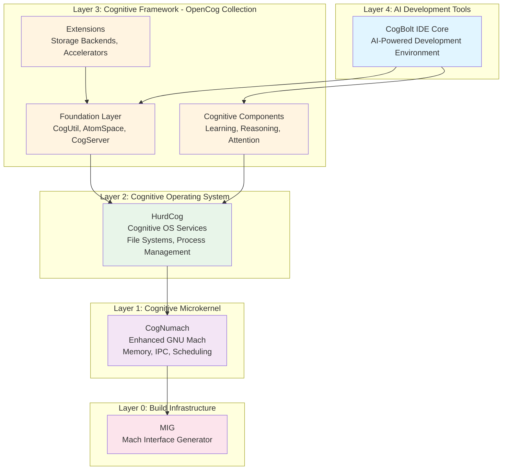

### 1.2 Layer Descriptions

#### Layer 0: Build Infrastructure (MIG)
- **Purpose:** Mach Interface Generator for IPC definitions
- **Technology:** GNU autotools, custom code generation
- **Key Function:** Generates communication interfaces between kernel and user space

#### Layer 1: Cognitive Microkernel (CogNumach)
- **Base:** Enhanced GNU Mach microkernel
- **Key Features:**
  - Cognitive-aware memory management
  - IPC with cognitive routing and prioritization
  - Hardware abstraction with cognitive optimization
  - 64-bit architecture support
- **Languages:** C, Assembly
- **Build System:** GNU autotools with CMake integration

#### Layer 2: Cognitive Operating System (HurdCog)
- **Base:** GNU Hurd with cognitive extensions
- **Key Features:**
  - Cognitive filesystem with semantic caching
  - Cognitive process scheduling
  - Translator architecture for extensibility
  - Self-aware system management
- **Languages:** C, Python, Scheme
- **Build System:** GNU autotools with CMake integration

#### Layer 3: Cognitive Framework (OpenCog Collection)
- **Purpose:** Complete AGI framework providing reasoning, learning, and perception
- **Components:**
  - **Foundation:** CogUtil, AtomSpace (hypergraph database), CogServer
  - **Cognitive:** PLN (reasoning), ECAN (attention), MOSES (learning), Pattern Miner
  - **Language:** Link Grammar, RelEx, NLP components
  - **Perception:** Vision processing
  - **Storage:** Multiple backends (RocksDB, PostgreSQL, IPFS)
- **Languages:** C++, Python, Scheme
- **Build System:** CMake

#### Layer 4: AI Development Tools (CogBolt)
- **Purpose:** AI-powered integrated development environment
- **Key Features:**
  - Code completion and generation
  - Intelligent refactoring
  - Performance profiling
  - Integration with GGML/LLM models
- **Languages:** C++
- **Build System:** CMake with vcpkg

---

## 2. Component Architecture

### 2.1 OpenCog AtomSpace - Core Knowledge Representation

The AtomSpace is the central knowledge representation system, implemented as a weighted, labeled hypergraph database:

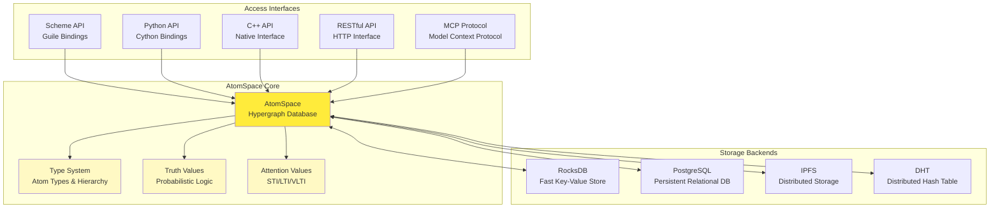

**AtomSpace Characteristics:**
- **Atoms:** Nodes (constants) and Links (relationships)
- **Truth Values:** Probabilistic strength and confidence
- **Attention Values:** STI (short-term importance), LTI (long-term importance), VLTI (very long-term importance)
- **Pattern Matching:** Powerful query and unification engine
- **Concurrent Access:** Thread-safe with fine-grained locking

### 2.2 Cognitive Components Interaction

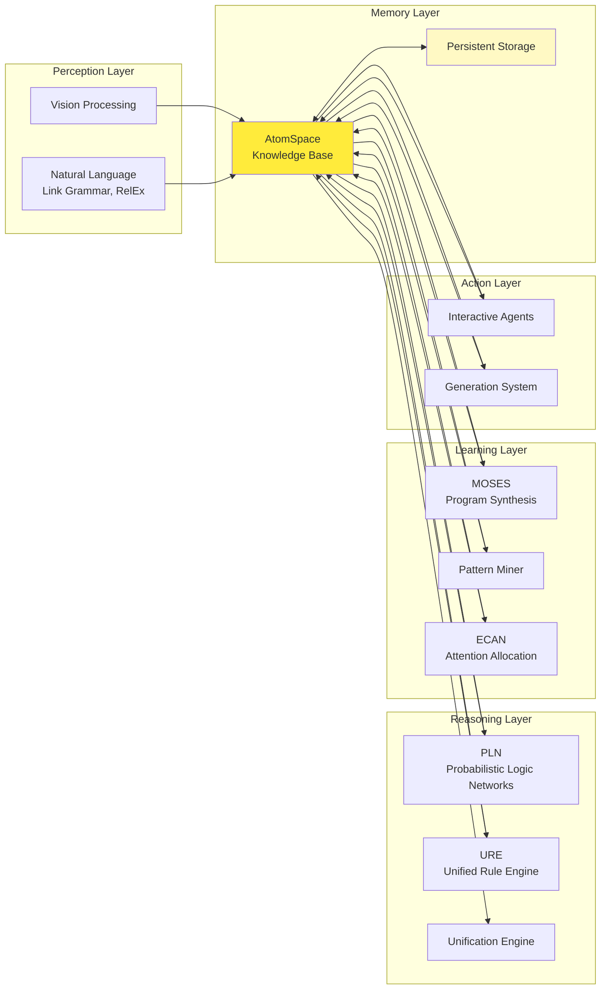

---

## 3. Data Flow Architecture

### 3.1 Boot and Initialization Sequence

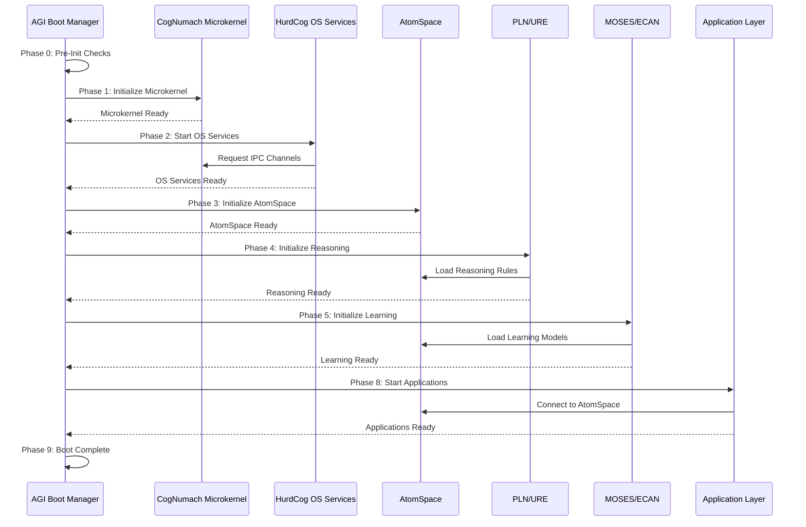

### 3.2 Cognitive Task Processing Flow

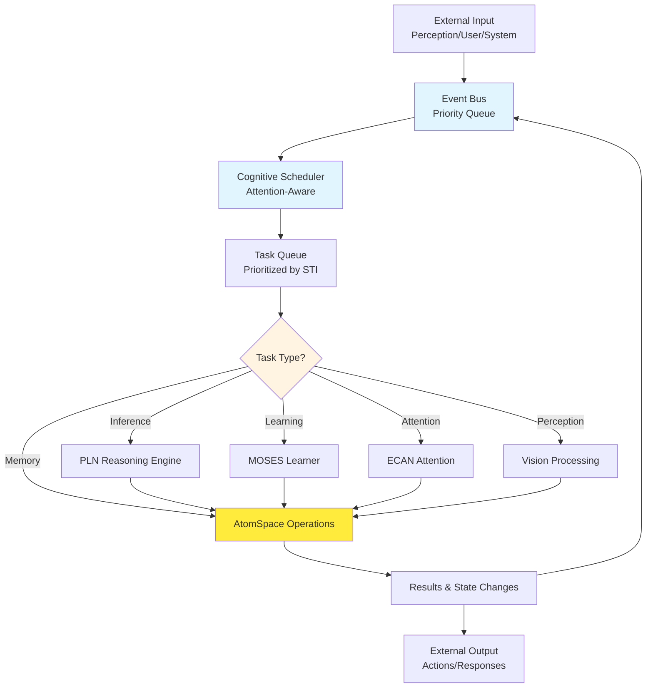

### 3.3 Inter-Layer Communication Flow

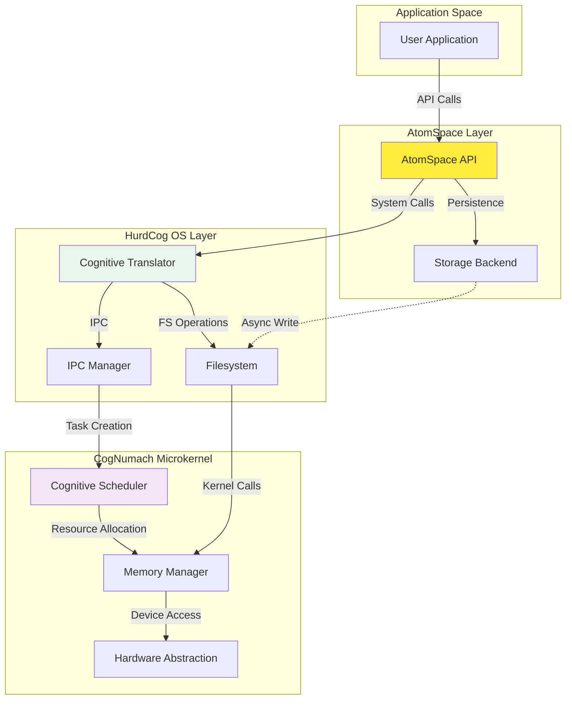

---

## 4. Integration Boundaries

### 4.1 External System Integration Points

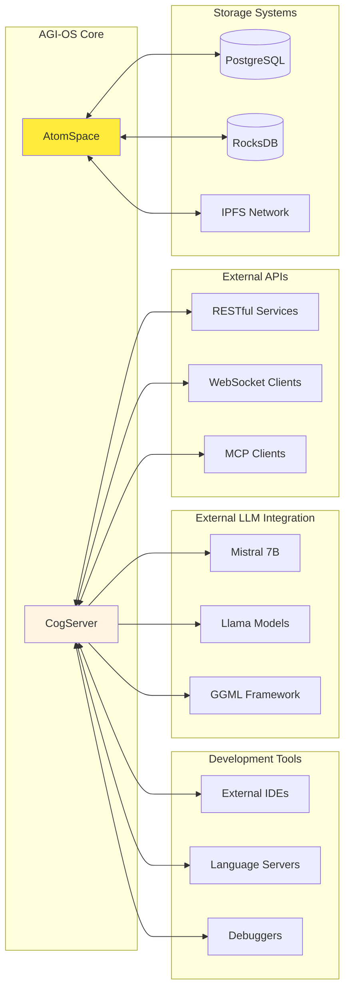

### 4.2 API Endpoints and Protocols

The AGI-OS exposes multiple API layers for external integration:

#### CogServer Network APIs

1. **Model Context Protocol (MCP)**
   - Endpoint: `mcp://cogserver:17001/atomese`
   - Purpose: AI model integration, standardized context sharing
   - Transport: TCP, UNIX sockets, HTTP
   - Features: Tool discovery, resource access, prompt templates

2. **RESTful HTTP API**
   - Endpoint: `http://cogserver:18080/api/v1/*`
   - Purpose: Web service integration
   - Methods: GET, POST, PUT, DELETE
   - Resources: Atoms, Queries, Commands

3. **Scheme Shell (REPL)**
   - Endpoint: `telnet://cogserver:17001`
   - Purpose: Interactive Scheme programming
   - Protocol: Line-based text protocol
   - Features: Live introspection, script execution

4. **Python API**
   - Module: `opencog.atomspace`
   - Purpose: Embedded Python applications
   - Features: Direct AtomSpace access, bindings generation

#### Storage Backend Protocols

1. **PostgreSQL Backend**
   - Connection: Standard PostgreSQL protocol
   - Features: ACID transactions, SQL queries, persistent storage

2. **RocksDB Backend**
   - Access: Embedded key-value store
   - Features: High performance, LSM-tree storage

3. **IPFS Backend**
   - Protocol: IPFS network protocol
   - Features: Content-addressed storage, distributed replication

### 4.3 Security Boundaries

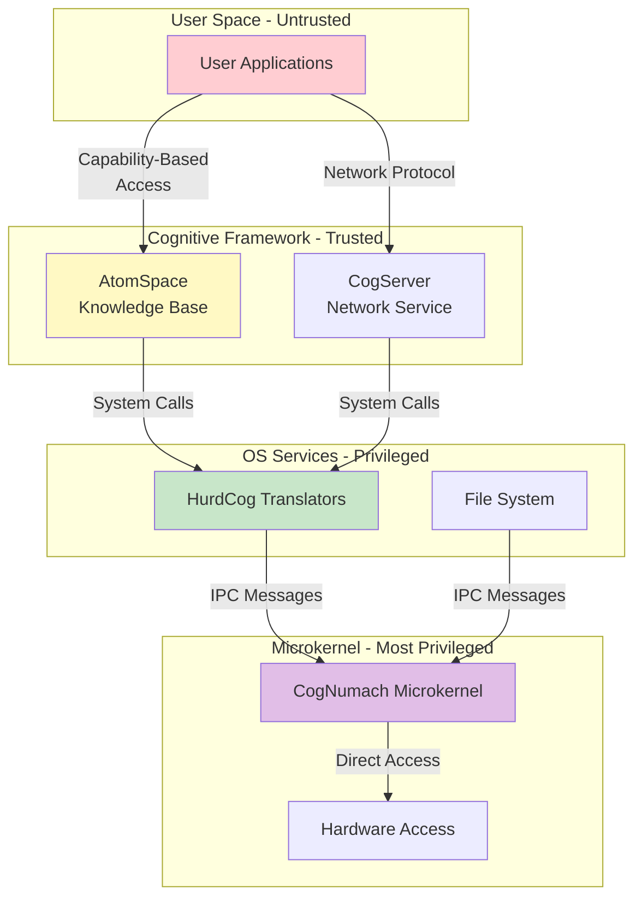

---

## 5. Build and Dependency Architecture

### 5.1 Build Dependency Graph

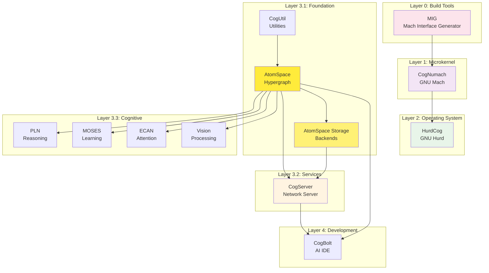

### 5.2 Critical Build Dependencies

The build system enforces the following strict ordering to ensure all dependencies are satisfied:

1. **CogUtil** (no dependencies) - Foundation library
2. **AtomSpace** (requires CogUtil) - Core knowledge representation
3. **AtomSpace Storage** (requires AtomSpace) - **CRITICAL: Must precede CogServer**
4. **CogServer** (requires AtomSpace + Storage) - Network services
5. **Cognitive Components** (require AtomSpace) - PLN, MOSES, ECAN, etc.
6. **Extensions** (require AtomSpace + specific components)

**Critical Note:** The `atomspace-storage` package is a **mandatory prerequisite** for `cogserver` because CogServer's s-expression parser depends on storage backend functionality.

---

## 6. Operational Characteristics

### 6.1 Performance Profile

| Component | Latency | Throughput | Concurrency |
|-----------|---------|------------|-------------|
| AtomSpace Insert | ~10 μs | 100K ops/sec | High (lock-free reads) |
| AtomSpace Query | 100 μs - 10 ms | 10K queries/sec | High (parallel) |
| PLN Inference | 1 ms - 1 sec | Problem-dependent | Medium |
| MOSES Learning | 1 sec - hours | Problem-dependent | Low (CPU-bound) |
| CogServer Network | <1 ms | 10K requests/sec | High (async I/O) |
| RocksDB Backend | 100 μs | 50K ops/sec | High (LSM-tree) |

### 6.2 Resource Requirements

**Minimum Requirements:**
- CPU: 4 cores, x86_64 or ARM64
- RAM: 4 GB
- Storage: 10 GB
- OS: Linux (Debian 11+, Ubuntu 20.04+)

**Recommended for Production:**
- CPU: 16+ cores, x86_64
- RAM: 32+ GB
- Storage: 100+ GB SSD (NVMe preferred)
- Network: 1 Gbps
- GPU: CUDA-capable for AtomSpace Accelerator (optional)

### 6.3 Scalability Characteristics

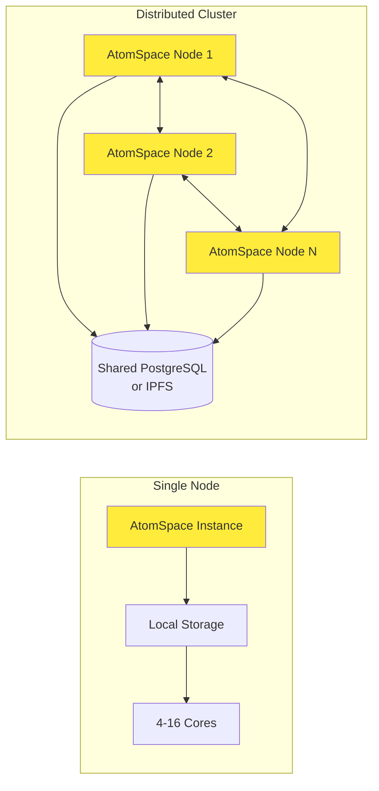

**Scaling Strategies:**
1. **Vertical Scaling:** Increase CPU cores, RAM (effective up to 64 cores)
2. **Horizontal Scaling:** Distribute AtomSpace across multiple nodes via MachSpace
3. **Storage Scaling:** Use PostgreSQL replication or IPFS for distributed storage
4. **GPU Acceleration:** Use AtomSpace Accelerator for inference workloads

---

## 7. Technology Stack

### 7.1 Programming Languages

| Language | Usage | Primary Components |
|----------|-------|-------------------|
| C | Microkernel, OS core | CogNumach, HurdCog kernel |
| C++ | Cognitive framework | AtomSpace, PLN, MOSES, CogBolt |
| Python | Bindings, scripts, tools | API bindings, build scripts, cognitive extensions |
| Scheme (Guile) | Cognitive programming | AtomSpace queries, PLN rules, cognitive scripts |
| Assembly | Low-level kernel | Boot code, context switching |

### 7.2 Key Dependencies

**Core Libraries:**
- Boost (filesystem, thread, system, program_options)
- Guile 3.0 (Scheme interpreter)
- Python 3.8+ (language bindings)
- RocksDB (storage backend)
- PostgreSQL libpq (database backend)
- OpenCV (vision processing)
- Link Grammar (NLP)

**Build Tools:**
- CMake 3.12+
- GNU Make
- GNU Autotools (autoconf, automake, libtool)
- GCC 9+ or Clang 10+
- Debian packaging tools (debhelper, dpkg-dev)

**Development Tools:**
- Git (version control)
- GitHub Actions (CI/CD)
- ccache (compiler cache)
- Valgrind (memory debugging)
- GDB (debugging)

---

## 8. Deployment Architecture

### 8.1 Deployment Models

#### 8.1.1 Single-Node Development

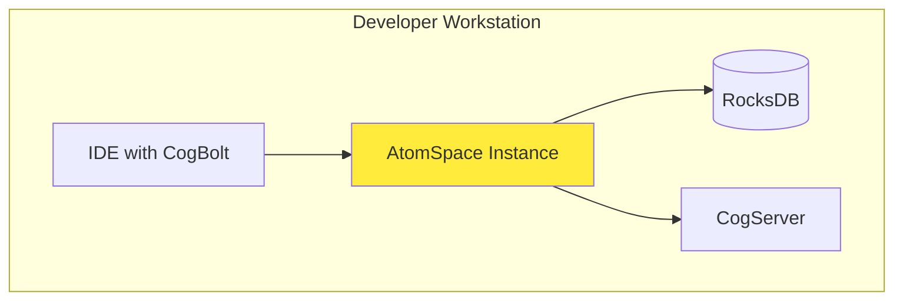

**Use Case:** Development, testing, small-scale experiments

#### 8.1.2 Production Server

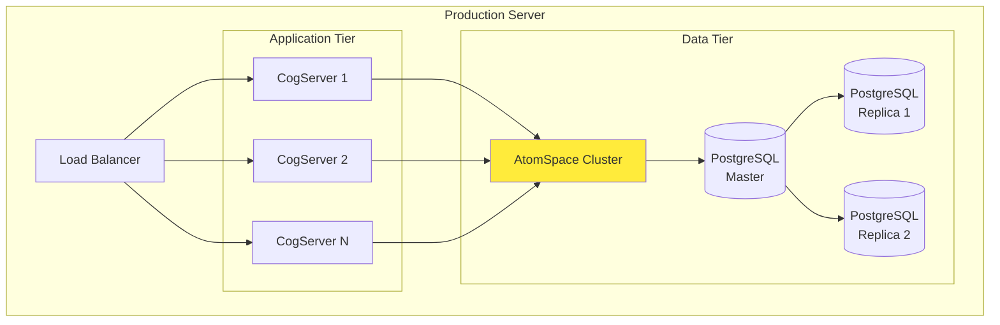

**Use Case:** Production deployments, high availability, load distribution

#### 8.1.3 Distributed AGI Cluster

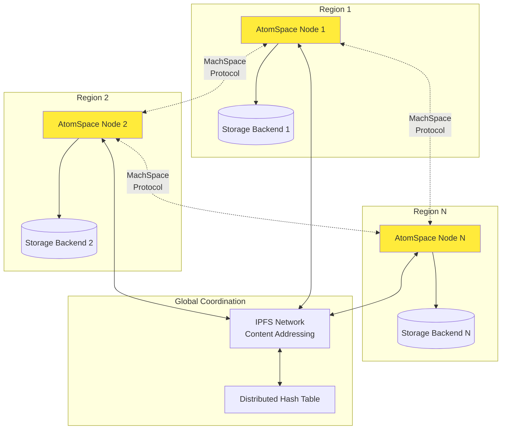

**Use Case:** Large-scale AGI systems, distributed reasoning, global knowledge sharing

### 8.2 Packaging and Distribution

AGI-OS provides comprehensive Debian packaging for all components:

**Package Categories:**
1. **Microkernel Packages:** cognumach, cognumach-dev
2. **OS Packages:** hurdcog, hurdcog-dev, hurdcog-libs
3. **Foundation Packages:** libcogutil, libatomspace, libatomspace-storage
4. **Service Packages:** cogserver
5. **Cognitive Packages:** libpln, libmoses, libecan, libgenerate
6. **Extension Packages:** atomspace-rocks, atomspace-pgres, atomspace-ipfs
7. **Development Packages:** All packages have corresponding -dev packages

**Installation Methods:**
- **Debian Packages:** `dpkg -i` or `apt install`
- **Source Build:** `./build-agi-os.sh`
- **Docker Containers:** (planned)

---

## 9. Monitoring and Observability

### 9.1 System Health Monitoring

AGI-OS provides comprehensive monitoring through multiple channels:

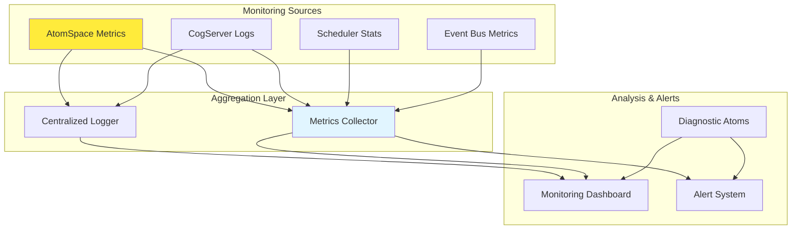

**Key Metrics:**
- AtomSpace size (atom count, memory usage)
- Query performance (latency, throughput)
- Attention dynamics (STI/LTI distributions)
- Inference rate (PLN steps per second)
- Learning progress (MOSES generations, fitness)
- Network throughput (CogServer requests/responses)
- System resources (CPU, memory, disk I/O)

### 9.2 Diagnostic Capabilities

AGI-OS includes self-diagnostic capabilities through the Diagnostic Atom Framework:

1. **Error Detection:** Automatic detection of reasoning errors, prediction mismatches
2. **Performance Monitoring:** Real-time tracking of cognitive component performance
3. **Attention Analysis:** Monitoring of attention allocation and focus shifts
4. **Learning Progress:** Tracking of learning milestones and convergence
5. **System Health:** Overall system health assessment and anomaly detection

---

## 10. Security Architecture

### 10.1 Security Model

AGI-OS leverages the Mach microkernel's capability-based security model:

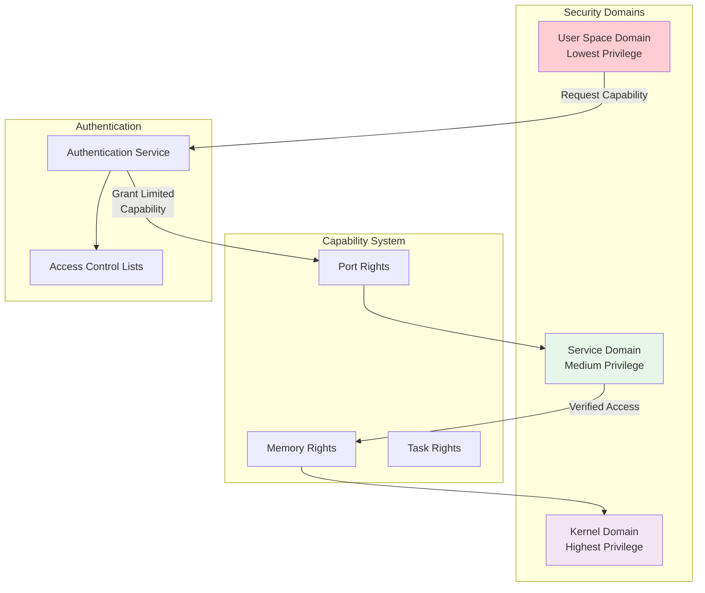

**Security Features:**
1. **Capability-Based Access Control:** Fine-grained permissions via Mach ports
2. **Process Isolation:** Each component runs in isolated address space
3. **Cognitive Monitoring:** Anomaly detection through attention mechanisms
4. **Signed Packages:** GPG-signed Debian packages for distribution
5. **Secure IPC:** Encrypted inter-process communication (optional)

### 10.2 Attack Surface Minimization

**Microkernel Benefits:**
- Minimal kernel code (~60K lines vs. millions in monolithic kernels)
- Device drivers in user space (isolation)
- File systems in user space (sandboxing)
- Clear security boundaries between components

---

## 11. Future Architecture Evolution

### 11.1 Planned Enhancements

1. **Phase 2: Enhancement (Q1-Q2 2026)**
   - Complete Python and Guile bindings for all components
   - Docker containerization
   - Performance optimization (GPU acceleration, distributed AtomSpace)

2. **Phase 3: Integration (Q3-Q4 2026)**
   - Distributed AtomSpace via MachSpace protocol
   - Cognitive fusion reactor (multi-algorithm integration)
   - External LLM integration (Mistral, GPT, Claude)
   - Self-aware system management

3. **Phase 4: Autonomy (2027+)**
   - Full cognitive kernel (self-modifying system)
   - Autonomous repair and optimization
   - Meta-learning capabilities
   - Emergent behaviors and goal formation

### 11.2 Research Directions

- **Cognitive Architecture:** Advanced attention mechanisms, hierarchical memory
- **Distributed Reasoning:** Efficient distributed inference algorithms
- **Neural-Symbolic Integration:** Hybrid neural network + symbolic reasoning
- **Self-Modification:** Safe self-improving system architecture
- **Meta-Learning:** Learning to learn, transfer learning across domains

---

## 12. Conclusion

AGI-OS represents a unique integration of microkernel architecture, operating system services, and cognitive AI framework into a unified whole. The system's layered architecture provides:

1. **Cognitive Integration:** Cognitive capabilities at every architectural layer
2. **Modularity:** Clean separation of concerns with well-defined interfaces
3. **Scalability:** From single developer workstation to distributed clusters
4. **Extensibility:** Plugin architecture for storage, reasoning, and learning
5. **Production-Ready:** Complete packaging, deployment, and monitoring infrastructure

The architecture balances theoretical cognitive science principles with practical engineering considerations, creating a foundation for future AGI research and development.

---

## Appendix A: Glossary

| Term | Definition |
|------|------------|
| **Atom** | Basic unit in AtomSpace: Node (constant) or Link (relationship) |
| **AtomSpace** | Weighted, labeled hypergraph database for knowledge representation |
| **Capability** | Unforgeable reference to a kernel resource (Mach concept) |
| **CogBolt** | AI-powered integrated development environment |
| **CogNumach** | Enhanced GNU Mach microkernel with cognitive capabilities |
| **CogServer** | Network server providing access to AtomSpace and cognitive services |
| **ECAN** | Economic Attention Networks - attention allocation algorithm |
| **HurdCog** | GNU Hurd operating system with cognitive extensions |
| **IPC** | Inter-Process Communication |
| **LTI** | Long-Term Importance - attention value for long-term memory |
| **MCP** | Model Context Protocol - standardized AI model integration |
| **MIG** | Mach Interface Generator - IPC definition compiler |
| **MOSES** | Meta-Optimizing Semantic Evolutionary Search - program synthesis |
| **PLN** | Probabilistic Logic Networks - uncertain reasoning engine |
| **STI** | Short-Term Importance - attention value for working memory |
| **Translator** | User-space server implementing a filesystem or service (Hurd concept) |
| **URE** | Unified Rule Engine - generic forward/backward chaining |

## Appendix B: References

1. **OpenCog Project:** https://opencog.org/
2. **GNU Mach Documentation:** https://www.gnu.org/software/hurd/microkernel/mach/
3. **GNU Hurd Documentation:** https://www.gnu.org/software/hurd/
4. **AtomSpace Documentation:** https://wiki.opencog.org/w/AtomSpace
5. **PLN Documentation:** https://wiki.opencog.org/w/PLN
6. **MOSES Documentation:** https://wiki.opencog.org/w/MOSES

---

**Document Version:** 1.0  
**Last Updated:** December 12, 2025  
**Maintained By:** AGI-OS Development Team  
**License:** GNU AGPL-3.0 (OpenCog), GPL-2.0 (Mach/Hurd)
