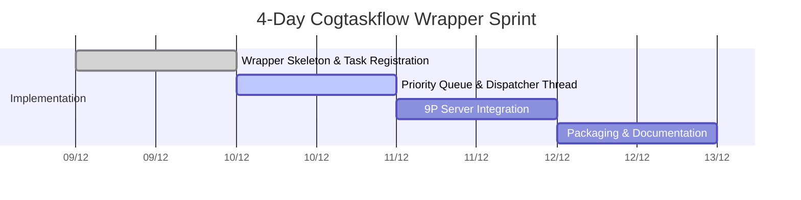

# Detailed Implementation Plan: Cogtaskflow Wrapper

**Date**: December 9, 2025  
**Version**: 1.0  
**Author**: Manus AI

## 1. Overview

This document provides a detailed, day-by-day implementation plan for the **Cogtaskflow Wrapper**. This is an accelerated, 4-day sprint that will deliver a functional, attention-based cognitive scheduler built on top of `cogtaskflow` and exposed via the 9P server.

## 2. 4-Day Sprint Plan

### Day 1: Wrapper Skeleton and Task Registration

*   **Goal**: To create the basic structure of the wrapper and the ability to register tasks.
*   **Implementation Steps**:
    1.  Create a new directory, `integration/cogtaskflow-wrapper/`.
    2.  Create the `CogtaskflowWrapper.h` file with the class definition as specified in the design document.
    3.  Implement the constructor, destructor, and the `register_task()` method.
    4.  Add `cogtaskflow` as a dependency in the `CMakeLists.txt`.
    5.  Create a unit test, `test_wrapper.c`, that registers several dummy tasks and verifies that they are correctly added to the `_task_registry`.
*   **Deliverable**: A compilable `CogtaskflowWrapper` class and a passing unit test for task registration.

### Day 2: Priority Queue and Dispatcher Thread

*   **Goal**: To implement the core priority-based scheduling logic.
*   **Implementation Steps**:
    1.  Add a `std::priority_queue` to the `CogtaskflowWrapper` class to store `CognitiveTask*` pointers, ordered by attention value.
    2.  Implement the `dispatcher_loop()` function. This will be a simple loop that:
        a.  Locks the mutex.
        b.  Pulls the highest-priority task from the queue.
        c.  Submits the task to the `_executor`.
        d.  Unlocks the mutex.
        e.  Sleeps for a short duration.
    3.  Start the `_dispatcher_thread` in the constructor.
    4.  Update the unit test to register several tasks with different attention values and verify that they are executed in the correct order.
*   **Deliverable**: A functional dispatcher thread that executes tasks based on their attention values.

### Day 3: 9P Server Integration

*   **Goal**: To expose the wrapper's functionality through the 9P server.
*   **Implementation Steps**:
    1.  Modify the `p9-server/main.c` to include the `CogtaskflowWrapper.h`.
    2.  Create a single, global instance of the `CogtaskflowWrapper`.
    3.  Implement the `read` and `write` callbacks for the `/attention` file. These callbacks will call the `get_all_attention()` and `set_attention()` methods of the wrapper instance.
    4.  Implement the `read` callback for the `/tasks` file.
    5.  Create an integration test script, `test_p9_integration.py`, that:
        a.  Reads the `/tasks` file and verifies that it contains the expected tasks.
        b.  Reads the `/attention` file and verifies the default attention values.
        c.  Writes a new attention value to the `/attention` file.
        d.  Reads the `/attention` file again and verifies that the value was updated.
*   **Deliverable**: A functional 9P server that can be used to observe and control the cognitive scheduler.

### Day 4: Final Packaging and Documentation

*   **Goal**: To create the final Debian package and document the new scheduler.
*   **Implementation Steps**:
    1.  Create a new Debian package, `hurdcog-cognitive-scheduler`, that contains the `cogtaskflow-wrapper`.
    2.  Update the `hurdcog-p9-server` package to depend on the new scheduler package.
    3.  Build both `.deb` packages.
    4.  Write a comprehensive `README.md` for the new scheduler, explaining:
        a.  Its architecture (wrapper, priority queue, dispatcher).
        b.  How to register new cognitive tasks.
        c.  How to control it via the 9P server.
    5.  Perform a final, end-to-end test of the entire system.
*   **Deliverable**: `hurdcog-cognitive-scheduler.deb`, `hurdcog-p9-server.deb`, and complete documentation.

## 3. Gantt Chart

## 4. Success Criteria

This sprint will be successful when:

1.  Both `hurdcog-cognitive-scheduler.deb` and `hurdcog-p9-server.deb` build and install correctly.
2.  The `test_p9_integration.py` script passes without errors.
3.  A user can manually `cat` and `echo` to the `/mnt/cog/attention` file and observe the change in task execution behavior (e.g., by watching the output of the dummy tasks).
4.  The documentation is clear and sufficient for a new developer to understand and use the new scheduler.
