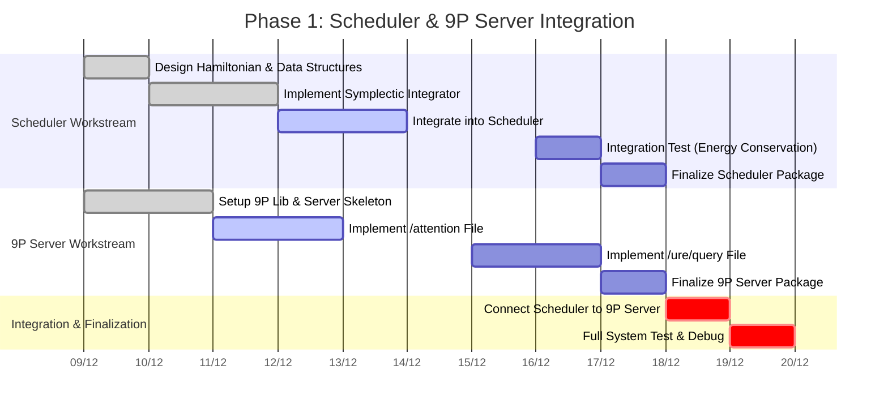

# Phase 1: Integrated Timeline and Dependencies

**Date**: December 9, 2025  
**Version**: 1.0  
**Author**: Manus AI

## 1. Overview

This document provides an integrated timeline for the two key deliverables of Phase 1: the **Cognumach Symplectic Scheduler** and the **Prototype 9P Server**. It outlines the parallel workstreams and identifies the critical dependencies between them.

**Total Estimated Timeline**: 10 working days (2 weeks).

## 2. Parallel Workstreams

The development of the scheduler and the 9P server can happen largely in parallel, with two key integration points. We can assign two developers to work on this in parallel: one for each component.

*   **Workstream A**: Cognumach Symplectic Scheduler (Developer A)
*   **Workstream B**: Prototype 9P Server (Developer B)

## 3. Integrated Gantt Chart (10-Day Sprint)

## 4. Critical Path and Dependencies

The critical path for this phase involves the successful integration of the two components.

### Dependency 1: `scheduler` → `p9-server` (Day 7)

*   **Task**: The 9P server needs to be able to get and set attention values in the scheduler.
*   **Dependency**: The scheduler must expose two new functions in a header file (`cognitive_scheduler.h`):
    *   `map<int, float> get_all_attention_values();`
    *   `void set_attention_value(int task_id, float value);`
*   **Timeline**: Developer A (Scheduler) should provide a stub implementation of these functions by **Day 3** so that Developer B (9P Server) is not blocked.

### Dependency 2: `p9-server` → `scheduler` (Day 9)

*   **Task**: The scheduler needs to receive attention values, not from a direct IPC message, but by reading them from the 9P server. This closes the loop.
*   **Dependency**: The 9P server must have a functional `/attention` file by **Day 8**.
*   **Timeline**: On **Day 9**, Developer A will modify the scheduler to act as a 9P *client*, reading its own attention values from the `/mnt/cog/attention` file. This is a crucial integration step.

### Final Integration (Days 9-10)

*   **Day 9**: The focus is on connecting the two completed components. The scheduler will be modified to read its configuration from the 9P server, and the 9P server will be tested to ensure it can correctly control the scheduler.
*   **Day 10**: A full system test will be performed. This will involve running the entire AGI-OS stack with the new scheduler and 9P server, and running a test script that:
    1.  Writes to the `/mnt/cog/attention` file.
    2.  Verifies that the scheduler responds correctly (by observing CPU usage).
    3.  Writes a query to `/mnt/cog/ure/query`.
    4.  Reads the correct result.

## 5. Resource Allocation

*   **Developer A (Senior Systems Engineer)**: Responsible for the Cognumach Symplectic Scheduler. This requires deep kernel knowledge and mathematical understanding.
*   **Developer B (Software Engineer)**: Responsible for the Prototype 9P Server. This requires strong C programming skills and experience with network protocols.
*   **QA Engineer**: Will be responsible for executing the integration tests on Days 9 and 10, and for verifying the final Debian packages.

## 6. Success Criteria for Phase 1

Phase 1 will be considered successful when:

1.  Both `cognumach-cognitive-scheduler.deb` and `hurdcog-p9-server.deb` are built and install successfully.
2.  The final integration test on Day 10 passes without errors.
3.  A user can manually interact with the running AGI-OS via the 9P file system to observe and influence its cognitive state.
