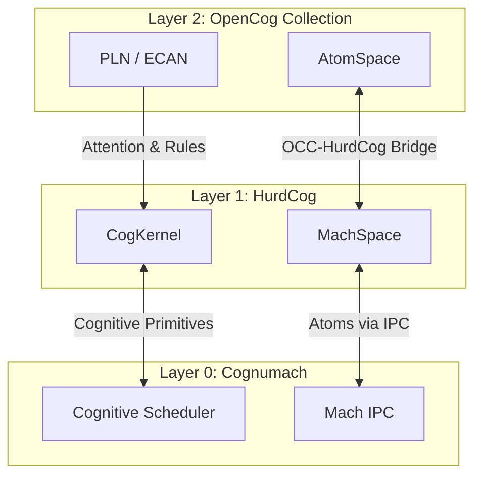
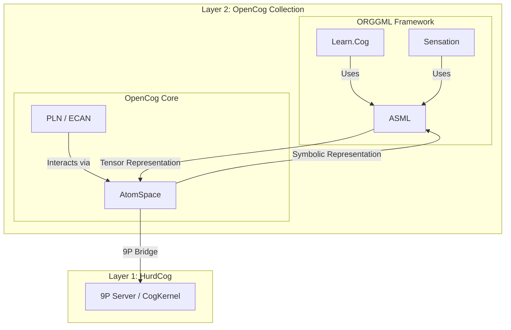

# A Unified Architecture for a Synergistic AGI: A Synthesis

**Date**: December 9, 2025  
**Version**: 1.0  
**Author**: Manus AI

## 1. Executive Summary

This document presents a comprehensive synthesis of a vast collection of technical and theoretical materials, aiming to forge a unified architectural vision for a production-ready, autonomous Artificial General Intelligence (AGI). By integrating concepts from the **AGI Operating System (AGI-OS)**, the **Plan 9 distributed computing philosophy**, the **GGML machine learning ecosystem**, advanced **mathematical frameworks**, and modern **hardware acceleration**, we propose a concrete and achievable roadmap for enhancing the `cogpy/occ` repository. The core thesis is that true AGI will not emerge from a single monolithic model, but from the **cognitive synergy** of deeply integrated components operating at every level of the system stack, from the microkernel to the application layer.

## 2. The AGI-OS: A Three-Layered Cognitive Architecture

The foundation of this unified vision is the AGI-OS, a three-layered system designed to embed cognitive capabilities into the very fabric of the operating system. This architecture, as detailed in the provided documents, moves beyond the traditional model of AI as a mere application and instead treats it as a fundamental system-level concern.

### 2.1. The Three Layers

The AGI-OS is composed of three distinct but deeply interconnected layers:

*   **Layer 0: Cognumach (The Cognitive Microkernel)**: An enhanced GNU Mach microkernel that provides cognitive-aware primitives. This includes copy-on-write optimized memory for large knowledge bases, symmetric multiprocessing for parallel cognitive tasks, and IPC mechanisms tailored for agent communication.

*   **Layer 1: HurdCog (The Cognitive Operating System)**: Built on Cognumach, HurdCog transforms the GNU Hurd into an OS that can learn and reason. It integrates the AtomSpace hypergraph directly into OS services via the **MachSpace** abstraction, enabling distributed cognitive processing across Hurd translators.

*   **Layer 2: OpenCog Collection (The AGI Framework)**: The application layer, providing a rich AGI research and development platform. This includes the AtomSpace, Probabilistic Logic Networks (PLN), Economic Attention Networks (ECAN), and various learning and reasoning components.

### 2.2. Core Integration Components

The synergy between these layers is achieved through a set of critical integration components:

| Component | Purpose | Key Function |
|---|---|---|
| **MachSpace** | Kernel-Level Hypergraph | Provides shared memory hypergraph storage and IPC-based atom management. |
| **CogKernel Core** | Cognitive OS Primitives | Implements attention-based scheduling and reasoning-enabled system calls. |
| **OCC-HurdCog Bridge** | Application-OS Integration | Creates a unified AtomSpace view across layers and propagates attention values. |
| **Cognitive Fusion Reactor** | Multi-Paradigm AI Integration | Coordinates symbolic, neural, and evolutionary components. |

This layered architecture, with its specialized integration bridges, creates a system where cognitive processes can flow seamlessly from high-level reasoning down to kernel-level resource allocation and back, forming a complete perception-action-reflection loop.



## 3. Plan 9: A Blueprint for Distributed Cognitive Resources

The provided documents on `cogplan9` and `kernel-plan9` offer a powerful and elegant philosophy for building distributed systems, which can be directly applied to the AGI-OS to simplify and unify its architecture. The core principles of Plan 9—**everything is a file**, **per-process namespaces**, and a **standard protocol for communication (9P)**—provide a robust framework for managing distributed cognitive resources.

### 3.1. Unifying AGI-OS Bridges with the 9P Protocol

Currently, the AGI-OS architecture relies on custom IPC mechanisms and bridges to connect its layers. The Plan 9 philosophy suggests a more elegant solution: represent all cognitive resources and services as file systems and use the 9P protocol for all inter-layer communication.

Instead of a custom `hurdcog-occ-bridge`, we can implement a **9P server** within the HurdCog layer. This server would expose the CogKernel and MachSpace as a file hierarchy. For example:

*   `/mnt/cog/attention`: A file that, when read, returns the current system-wide attention values. Writing to it could set the attention for a specific task.
*   `/mnt/cog/ure/query`: A control file where a query (as a string) can be written, and the result can be read back.
*   `/mnt/cog/machspace/`: A directory representing the root of the MachSpace hypergraph, where atoms appear as files and directories.

This approach offers several advantages:

*   **Simplicity and Uniformity**: All interactions with the cognitive OS use standard file operations (`open`, `read`, `write`, `close`), which are universally understood and available in all programming languages.
*   **Network Transparency**: The 9P protocol is inherently network-transparent. This means that an OpenCog application could access the HurdCog's cognitive services from a different machine without any changes to the code, facilitating distributed AGI.
*   **Flexibility**: Namespaces can be constructed on a per-process basis. A cognitive agent could, for example, mount the CogKernel of a remote machine into its own namespace to offload a complex reasoning task.

### 3.2. A Plan 9-Inspired AGI-OS Architecture

By adopting the Plan 9 philosophy, the AGI-OS architecture becomes cleaner and more powerful.

```mermaid
graph TD
    subgraph User Space (OCC)
        A[Cognitive Agent / Application]
    end
    subgraph Kernel Space (HurdCog / Cognumach)
        B[9P Server for Cognitive Services]
        C[CogKernel]
        D[Cognitive Scheduler]
        E[MachSpace]
    end
    A -- "mount /net/tcp/!/agi-os-host/!9/cog" --> B;
    B -- "/ure/query" --> C;
    B -- "/attention" --> D;
    B -- "/machspace/..." --> E;
```

This revised architecture replaces bespoke bridges with a single, standardized 9P interface, making the entire system more modular, scalable, and elegant.

## 4. ORGGML: A Practical Framework for Cognitive Components

The `orggml` and `orggml-kernel` documents propose a powerful strategy for structuring machine learning tools into a cohesive cognitive architecture. By reorganizing the popular `ggml` ecosystem (including `llama.cpp` and `whisper.cpp`) into a monorepo organized by cognitive function, it provides a clear and practical path for integrating state-of-the-art ML models into the AGI-OS.

### 4.1. Mapping ML Models to Cognitive Functions

The core insight of the `orggml` architecture is to treat ML models not as standalone tools, but as implementations of specific cognitive capabilities, directly analogous to the components of OpenCog. The provided diagram, `ggml_opencog_comparison(1).png`, illustrates this mapping perfectly.

| ORGGML Component | Cognitive Function | Origin (GGML) | OpenCog Analog |
|---|---|---|---|
| **ASML** | Knowledge Representation & Tensor Ops | `ggml` | AtomSpace |
| **Learn.Cog** | Language, Learning, Reasoning | `llama.cpp` | Language & Cognitive Modules |
| **Sensation** | Sensory Input Processing | `whisper.cpp` | Sensation Module |

This cognitive-first organization provides the ideal implementation strategy for the **Cognitive Fusion Reactor** described in the AGI-OS architecture. Instead of building a reactor from scratch, we can adopt the `orggml` structure as the framework for integrating diverse AI paradigms within Layer 2 (OCC).

### 4.2. Integrating ORGGML into the AGI-OS

The `orggml` framework can be integrated directly into the OpenCog Collection layer. The `ASML` (AtomSpace Machine Learning) component, derived from `ggml`, would serve as the foundational tensor library, providing the crucial bridge between the symbolic hypergraph of the AtomSpace and the sub-symbolic tensors of the neural network models.

The `Learn.Cog` and `Sensation` modules would become first-class cognitive components within OCC, alongside PLN and ECAN. They would interact with the rest of the system through the AtomSpace and the 9P-based bridge to the lower layers.



This integration yields a powerful synergy:

*   **LLMs as Cognitive Components**: `llama.cpp` (`Learn.Cog`) is no longer just a chat model; it becomes a reasoning and learning engine that can operate on atoms from the AtomSpace.
*   **Perception as a First-Class Citizen**: `whisper.cpp` (`Sensation`) provides a direct pathway for auditory perception to enter the cognitive system as structured knowledge in the AtomSpace.
*   **Unified Representation**: `ASML` provides the common language of tensors, allowing symbolic (`AtomSpace`) and sub-symbolic (`Learn.Cog`) components to communicate and cooperate effectively.
*   **Kernel-Level LLMs**: The concepts from `llama-kernel-cpp.md` and `kobold-kernel-ggml.md` can be realized by having the `Learn.Cog` component leverage the 9P bridge to offload specific computations to the `CogKernel`, enabling reasoning and inference tasks to be executed with kernel-level priority and efficiency.

## 5. Advanced Mathematical Frameworks: The Geometry of Cognition

The collection of documents on **Transformer Jacobians**, **Symplectic Geometry**, and the **Unified Dynamics Equation** provides a sophisticated mathematical toolkit for understanding and optimizing the internal dynamics of the AGI. These frameworks offer a path to move beyond heuristic-based scheduling and resource allocation and toward a principled, mathematically grounded approach to cognitive synergy.

### 5.1. Symplectic Flow and the Cognitive Scheduler

The document `MathematicalAnalysis_J-SurfaceFlowandSymplecticStructure.md` and the visualization in `SymplecticFlowGeometryVisualization.md` are particularly relevant to the `cognumach-cognitive-scheduler`. The current scheduler design uses a simple weighted formula to combine base priority with attention values. The concept of a **symplectic flow** offers a much more powerful and elegant model.

We can model the state of all tasks in the system as a point in a high-dimensional phase space. The evolution of the system over time, as tasks are scheduled and executed, can be described as a flow on this manifold. A symplectic integrator, as mentioned in the Julia documents (`ode_solve.jl`), is a numerical method that preserves the geometric properties of such a flow, ensuring that the system remains stable and energy-efficient over long periods.

**Proposed Enhancement for the Cognitive Scheduler**:

Instead of a simple weighted sum, the cognitive scheduler should implement a **symplectic integrator** to evolve the system state. The attention values from ECAN would not be used to directly modify priorities, but rather to define the **Hamiltonian** of the system—a function that describes the total "cognitive energy" of the system. The scheduler's goal would then be to follow the flow that minimizes this energy, naturally allocating resources to the most important tasks.

This approach has several benefits:

*   **Stability**: Symplectic integrators are known for their long-term stability, preventing the system from spiraling into chaotic or inefficient states.
*   **Efficiency**: The flow naturally finds the most efficient path for the system's evolution.
*   **Principled Design**: It replaces ad-hoc heuristics with a well-understood mathematical framework.

### 5.2. The Jacobian as a Measure of Cognitive Load

The document `TransformerJacobianInsightsforDeepTreeEcho.md` provides a key insight: the Jacobian of a neural network's output with respect to its input can be used as a measure of the model's sensitivity or "cognitive load." A high Jacobian norm indicates that a small change in the input can lead to a large change in the output, suggesting a region of high cognitive effort.

This concept can be directly integrated into the `Learn.Cog` component and the cognitive scheduler:

1.  When `Learn.Cog` (e.g., `llama.cpp`) is performing an inference task, it can compute the Jacobian of its internal state.
2.  This Jacobian norm can be passed as a component of the attention value to the cognitive scheduler via the 9P bridge.
3.  The scheduler can then use this information to allocate more CPU time or other resources to tasks that are undergoing high cognitive load, effectively giving the system more "thinking time" when it needs it most.

### 5.3. The Unified Dynamics Equation and Julia

The `UnifiedDynamicsEquationImplementation.md` and the suite of Julia files (`MultiScaleArrays.jl`, `ode_solve.jl`, `TaskflowIntegration.jl`) point to a powerful implementation strategy. Julia, with its high performance, native support for differential equations, and excellent multi-threading capabilities, is the ideal language for building a simulation and optimization engine for the AGI's cognitive dynamics.

We propose creating a new component within the OCC layer, the **Cognitive Dynamics Engine**, implemented in Julia. This engine would:

*   Implement the Unified Dynamics Equation to model the entire AGI-OS.
*   Use the `ode_solve.jl` library to simulate the system's evolution under different scheduling policies.
*   Use the `TaskflowIntegration.jl` to parallelize these simulations.
*   The results of these simulations would be used by the `cognitive_sched_learn` function to find optimal scheduling parameters (like the `sti_weight` and `lti_weight` mentioned in the original spec).

This creates a powerful feedback loop where the system can simulate its own future and choose the actions that lead to the most desirable outcomes, cognitively efficient outcomes.

## 6. Hardware Acceleration: The NPU and DGX Foundation

The provided datasheets for the **NVIDIA DGX** and the architectural diagrams for the **NPU (Neural Processing Unit)** and **vGPU stack** (`vgpu-software-stack.png`) underscore the importance of a hardware foundation that is as deeply integrated as the software stack. The AGI-OS must be designed to take full advantage of modern, massively parallel hardware.

### 6.1. Mapping the AGI-OS to Hardware

The three-layered AGI-OS architecture maps naturally onto the hardware stack:

*   **Layer 0 (Cognumach)**: The cognitive scheduler and Mach IPC primitives should be optimized to run directly on the NPU or the GPU's scheduling units. The ability to manage memory and schedule tasks at the hardware level is critical for low-latency cognitive operations.

*   **Layer 1 (HurdCog)**: The 9P server and the CogKernel can be implemented as CUDA or OpenCL kernels, allowing them to run directly on the GPU. This would enable the operating system itself to leverage the massive parallelism of the hardware for tasks like searching the MachSpace hypergraph.

*   **Layer 2 (OCC)**: The `orggml` components (`ASML`, `Learn.Cog`) are already designed to run on NVIDIA hardware. The Cognitive Dynamics Engine, implemented in Julia, can also leverage the GPU for its simulations.

The `vgpu-software-stack.png` provides a clear blueprint for how this virtualization can be managed, allowing multiple cognitive agents or AGI-OS instances to share a single physical DGX server, each with its own virtualized NPU and GPU resources.

## 7. Conclusion: A Unified Roadmap

This synthesis has woven together a diverse set of concepts into a single, coherent vision for the future of the `cogpy/occ` repository. By integrating the layered architecture of the AGI-OS, the distributed systems philosophy of Plan 9, the practical cognitive components of `orggml`, the mathematical rigor of symplectic geometry, and the power of modern hardware, we can create an AGI that is more than the sum of its parts.

This document provides the high-level vision. The subsequent phases of this analysis will break this down into concrete, actionable steps, starting with identifying specific integration opportunities and designing a detailed implementation plan.

## 8. References

*   AGI-OS Architecture Documents (`AGI_OS_ARCHITECTURE_ENHANCED.md`, etc.)
*   Plan 9 Documents (`cogplan9.md`, `kernel-plan9.md`)
*   ORGGML Documents (`orggml.md`, `orggml-kernel.md`)
*   Mathematical Analysis Documents (`TransformerJacobianInsightsforDeepTreeEcho.md`, etc.)
*   Julia Implementation Files (`ode_solve.jl`, etc.)
*   Hardware Specification Sheets (`NVIDIA-DGX-Spark-DS.pdf`, etc.)
