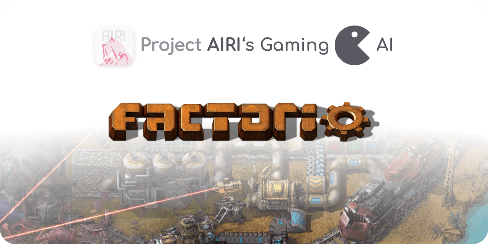
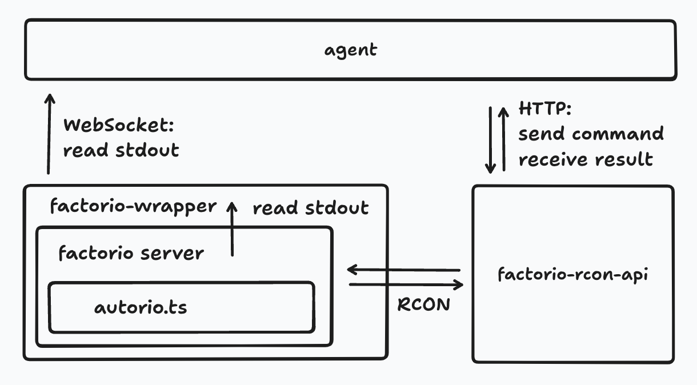

<p align="center">
  <picture>
    
  </picture>
</p>

<h1 align="center">
  Factorio for <a href="https://github.com/moeru-ai/airi">Project AIRI</a>
</h1>

> [!NOTE]
>
> This project is part of the [Project AIRI](https://github.com/moeru-ai/airi), we aim to build a wishing to achieve [Neuro-sama](https://www.youtube.com/@Neurosama)'s (subscribe if you didn't!) altitude, completely LLM and AI driven, capable of realtime voice chat, Minecraft playing, Factorio playing. If you are interested in, please do give it a try on [live demo](https://airi.moeru.ai).

## Development

### Project Structure

It's hard to describe the project structure in a few words, but it currently looks like this:

<div style="max-width: 500px; margin: 0 auto;">



</div>

### Start to develop

1. Clone the repository:

    ```bash
    git clone https://github.com/moeru-ai/airi-factorio
    ```

2. Install dependencies:

    ```bash
    pnpm i
    ```

3. Create a symlink for the `autorio` mod:

    ```bash
    cd /path/to/airi-factorio

    ln -s /path/to/airi-factorio/packages/autorio/dist /path/to/factorio/data/autorio
    # If you are using DevContainer, you can use the following command:
    ln -s /workspace/airi-factorio/packages/autorio/dist /opt/factorio/data/autorio
    ```

4. Copy and fill the `.env` file:

    ```bash
    cp packages/agent/.env.example packages/agent/.env.local
    cp packages/factorio-wrapper/.env.example packages/factorio-wrapper/.env.local
    ```

    If you are using DevContainer, you can set `WS_SERVER_HOST` and `FACTORIO_WS_HOST` and `RCON_API_SERVER_HOST` to `localhost`.

5. Create a game save file, the save file path should be the same as the one in the `.env` file:

    ```bash
    /path/to/factorio/bin/x64/factorio --create /path/to/factorio/the-save-file.zip
    # If you are using DevContainer, you can use the following command:
    /opt/factorio/bin/x64/factorio --create /path/to/factorio/the-save-file.zip
    # If your machine is not x64, you can use the following command:
    box64 /opt/factorio/bin/x64/factorio --create /path/to/factorio/the-save-file.zip
    ```

6. Run the development script:

    ```bash
    pnpm run dev
    ```

Now you can use the commands in Factorio, the script will be compiled automatically, but you need to exit and re-enter the game to see the changes(no need to restart the game).

## Other side projects born from Project AIRI like this one

- [Awesome AI VTuber](https://github.com/proj-airi/awesome-ai-vtuber): A curated list of AI VTubers and related projects
- [`unspeech`](https://github.com/moeru-ai/unspeech): Universal endpoint proxy server for `/audio/transcriptions` and `/audio/speech`, like LiteLLM but for any ASR and TTS
- [`hfup`](https://github.com/moeru-ai/hfup): tools to help on deploying, bundling to HuggingFace Spaces
- [`xsai-transformers`](https://github.com/moeru-ai/xsai-transformers): Experimental [🤗 Transformers.js](https://github.com/huggingface/transformers.js) provider for [xsAI](https://github.com/moeru-ai/xsai).
- [WebAI: Realtime Voice Chat](https://github.com/proj-airi/webai-realtime-voice-chat): Full example of implementing ChatGPT's realtime voice from scratch with VAD + STT + LLM + TTS.
- [`@proj-airi/drizzle-duckdb-wasm`](https://github.com/moeru-ai/airi/tree/main/packages/drizzle-duckdb-wasm/README.md): Drizzle ORM driver for DuckDB WASM
- [`@proj-airi/duckdb-wasm`](https://github.com/moeru-ai/airi/tree/main/packages/duckdb-wasm/README.md): Easy to use wrapper for `@duckdb/duckdb-wasm`
- [Airi Factorio](https://github.com/moeru-ai/airi-factorio): Allow Airi to play Factorio
- [Factorio RCON API](https://github.com/nekomeowww/factorio-rcon-api): RESTful API wrapper for Factorio headless server console
- [`autorio`](https://github.com/moeru-ai/airi-factorio/tree/main/packages/autorio): Factorio automation library
- [`tstl-plugin-reload-factorio-mod`](https://github.com/moeru-ai/airi-factorio/tree/main/packages/tstl-plugin-reload-factorio-mod): Reload Factorio mod when developing
- [`@velin-dev/ml`](https://github.com/luoling8192/velin): Use Vue SFC and Markdown to write easy to manage stateful prompts for LLM
- [`demodel`](https://github.com/moeru-ai/demodel): Easily boost the speed of pulling your models and datasets from various of inference runtimes.
- [`inventory`](https://github.com/moeru-ai/inventory): Centralized model catalog and default provider configurations backend service
- [MCP Launcher](https://github.com/moeru-ai/mcp-launcher): Easy to use MCP builder & launcher for all possible MCP servers, just like Ollama for models!
- [🥺 SAD](https://github.com/moeru-ai/sad): Documentation and notes for self-host and browser running LLMs.

## Credits

Thanks for the original idea and code: https://github.com/naklecha/factorio-automation
