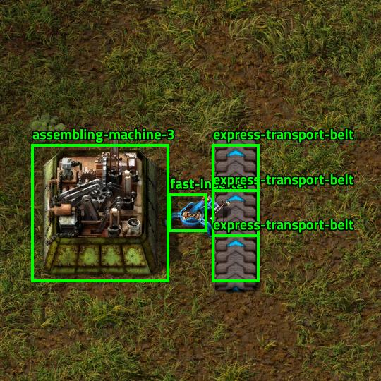
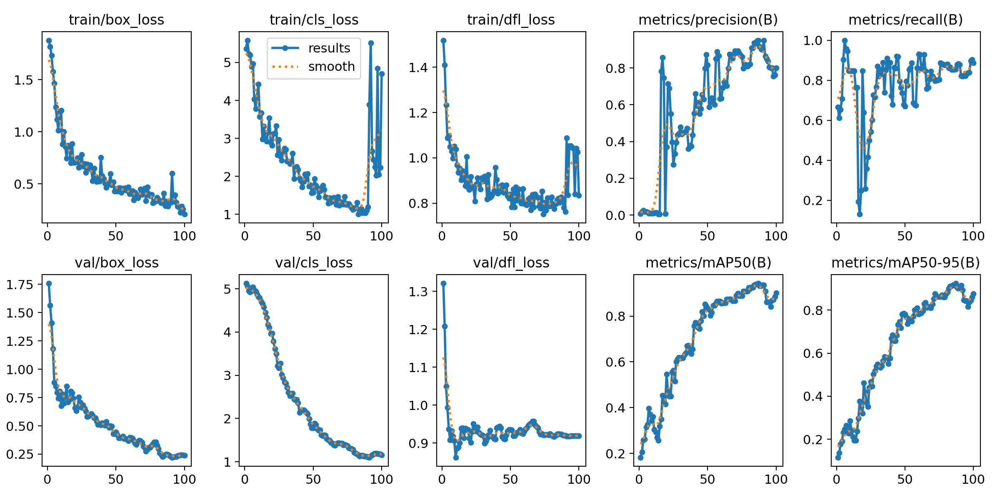
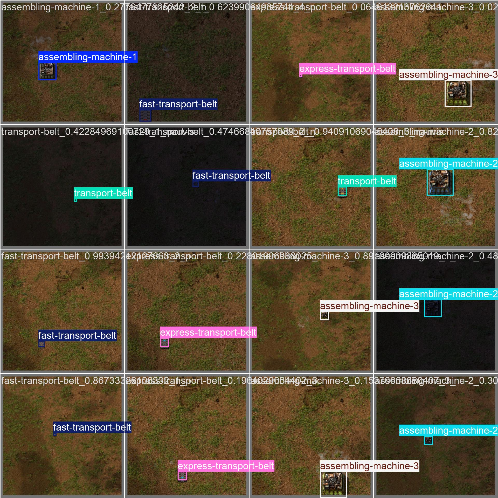
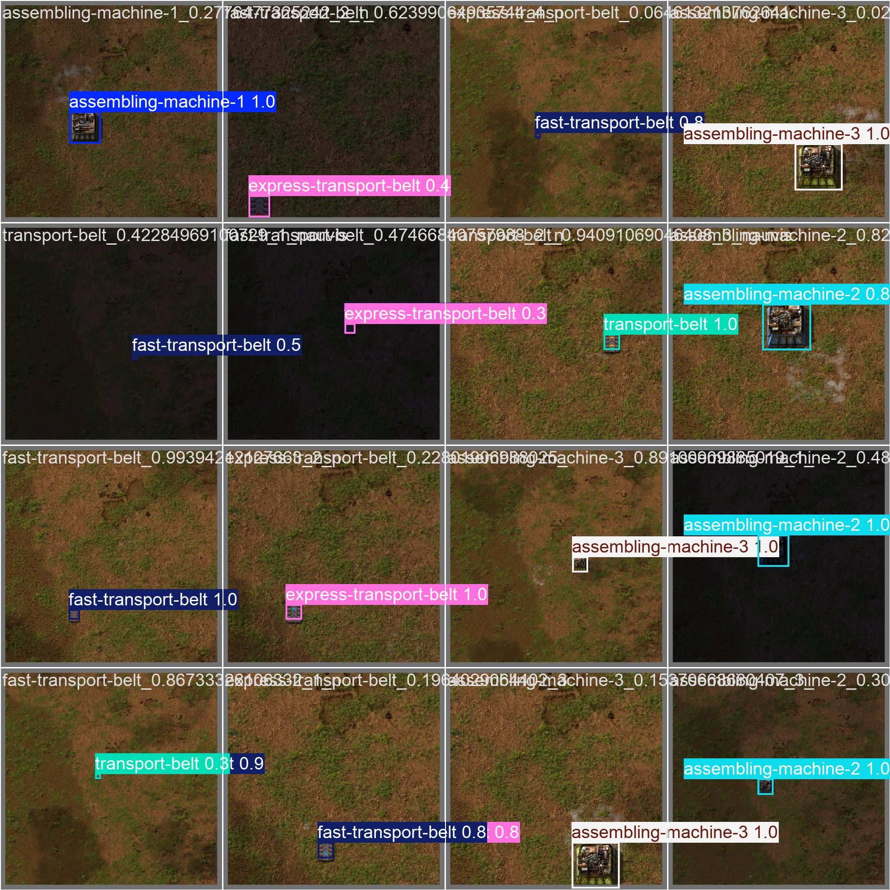

# Factorio YOLO v0



A model for detecting items in Factorio based on YOLOv11n. It can detect 6 items, see [names](./dataset/detect.yaml).

Playground is hosted on [HuggingFace](https://huggingface.co/spaces/proj-airi/factorio-yolo-v0-playground).

Available formats:
- ONNX
- PyTorch

## Results



Validation batch 0 labels and predictions:

<div style="display: flex; width: 100%; justify-content: center; gap: 1rem;">
  
  
</div>

## Dataset

The dataset is a collection of images of items in Factorio, [collector code here](../../packages/factorio-rcon-snippets-for-node/src/factorio_yolo_dataset_collector_v0.ts).

It contains 20 images for each item, 17 for training and 2 for validation and 1 for testing.

## Training

```bash
pixi train
```

## Predicting

It will show a window with the predicted bounding boxes.

```bash
pixi predict
```
