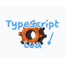
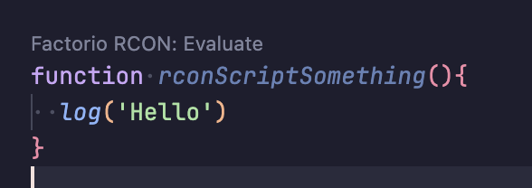

# vscode-factorio-rcon-evaluator



This extension allows you to evaluate TypeScript in Factorio using the RCON protocol. [VSCode Marketplace](https://marketplace.visualstudio.com/items?itemName=LemonNeko.vscode-factorio-rcon-evaluator)

It can helps you to debug your factorio script in VSCode.

This project is a part of [AIRI](https://github.com/moeru-ai/airi).

## Usage

Run your factorio server with the `--rcon-host`, `--rcon-port` and `--rcon-password` flags.

```bash
factorio --rcon-host localhost --rcon-port 27105 --rcon-password 123456
```

Write a top-level function with the start `rconScript` that contains the code you want to evaluate.

```typescript
function rconScript() {
  log('Hello, world!')
}
```

Then a code lens will appear above the function. Click it to run the script in Factorio.



## Configuration

You can configure the extension by adding the following settings to your `settings.json` file.

```json
{
  "vscode-factorio-rcon-evaluator": {
    "rconHost": "localhost",
    "rconPort": 27105,
    "rconPassword": "123456"
  }
}
```
