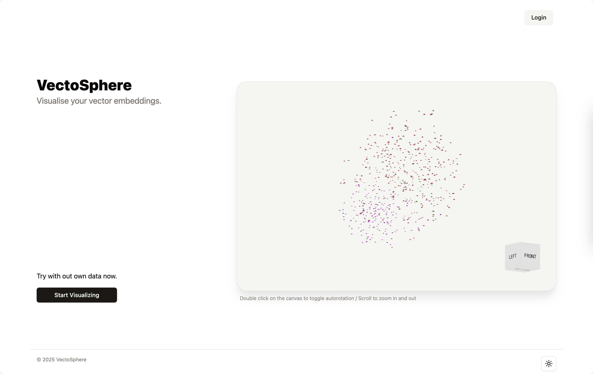

# Projects you can learn with

## Mathematical basis

- [Visualizing Your Embeddings | Towards Data Science](https://towardsdatascience.com/visualizing-your-embeddings-4c79332581a9/)

## Approaches explained

- [Visualizations of Embeddings. I submitted my first paper on AI in… | by Douglas Blank, PhD | TDS Archive | Medium](https://medium.com/data-science/visualizations-of-embeddings-2910580df7f4)
- [How to Visualize Embeddings with t-SNE, UMAP, and Nomic Atlas | Nomic Atlas Documentation](https://docs.nomic.ai/atlas/embeddings-and-retrieval/guides/how-to-visualize-embeddings)

## Reading list

This article shared a lot!

[What I've Learned Building Interactive Embedding Visualizations by Casey Primozic](https://cprimozic.net/blog/building-embedding-visualizations-from-user-profiles/)

Some of the screenshots shared from this article:

The effect and results, seems really impressive, and inspiring!

## Libraries

- [`umap`](https://umap-learn.readthedocs.io/en/latest/plotting.html)
- [zilliztech/feder: Visualize hnsw, faiss and other anns index](https://github.com/zilliztech/feder)

## Tools

- [Comparing Python Clustering Algorithms — hdbscan 0.8.1 documentation](https://hdbscan.readthedocs.io/en/latest/comparing_clustering_algorithms.html)
- [Visualizing text embeddings using MotherDuck and marimo - MotherDuck Blog](https://motherduck.com/blog/MotherDuck-Visualize-Embeddings-Marimo/)
- [DimensionReduction: Visualize Embedding Space — DNIKit 2.0.0 documentation](https://apple.github.io/dnikit/notebooks/data_introspection/dimension_reduction.html)
- [Quick Start - BERTopic](https://maartengr.github.io/BERTopic/getting_started/quickstart/quickstart.html)

## Applications

For the projects we could run in the browser, I found many too...

- [Word Embedding Visualization](https://helboukkouri.github.io/embedding-visualization/)

- [jessevig/bertviz: BertViz: Visualize Attention in NLP Models (BERT, GPT2, BART, etc.)](https://github.com/jessevig/bertviz)

Some one shared this in OpenAI community: [Visualising vector embeddings in the browser](https://community.openai.com/t/visualising-vector-embeddings-in-the-browser/187247):

And this, [stephanj/embeddings-visualization](https://github.com/stephanj/embeddings-visualization)
