# Moeru AI Monorepo - Technical Architecture Overview

## Executive Summary

The Moeru AI monorepo is a comprehensive collection of AI-powered applications and services focused on creating intelligent virtual companions and AI tooling infrastructure. The architecture is organized as a polyglot monorepo with projects in TypeScript/JavaScript, Rust, and Go, each serving distinct but interconnected purposes in the ecosystem.

## System Architecture

### High-Level Component Diagram

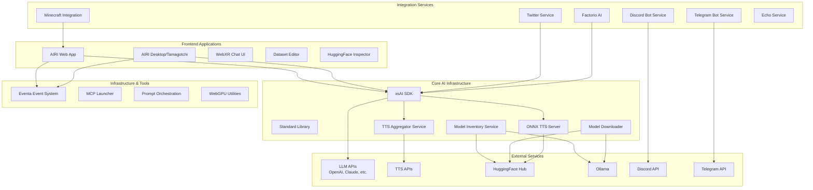

### Technology Stack Distribution

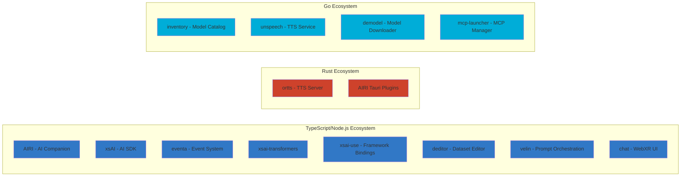

## Core Projects Deep Dive

### 1. AIRI - AI Companion System

**Technology**: TypeScript, Rust (Tauri plugins), Vue.js  
**Type**: Monorepo with multiple packages and services

#### Architecture

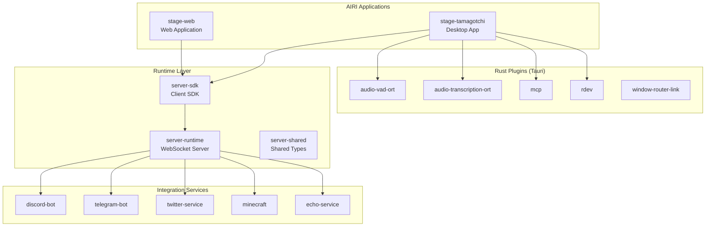

#### Key Components

- **stage-web**: Browser-based interface for AIRI
- **stage-tamagotchi**: Desktop application using Tauri
- **server-runtime**: WebSocket-based real-time communication server
- **Integration Services**: Bot services for various platforms
- **Rust Plugins**: Native capabilities (audio processing, VAD, transcription)

### 2. xsAI - Extra-Small AI SDK

**Technology**: TypeScript  
**Type**: Modular AI SDK monorepo

#### Architecture

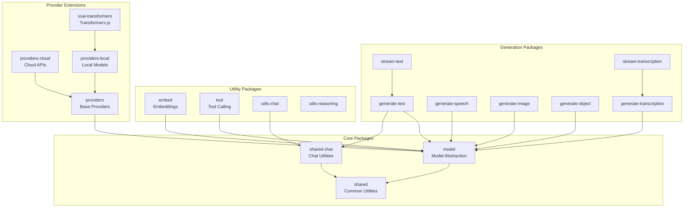

#### Provider Architecture

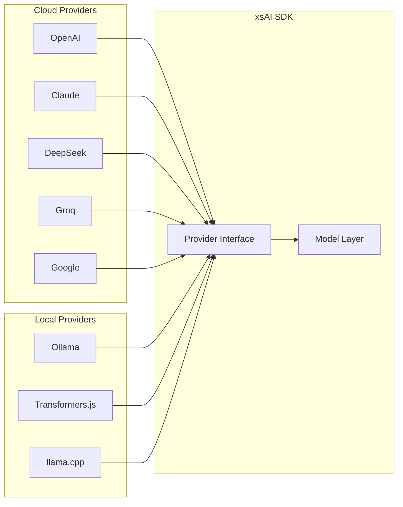

### 3. ortts - ONNX Runtime TTS Server

**Technology**: Rust  
**Type**: HTTP API server for text-to-speech

#### Architecture

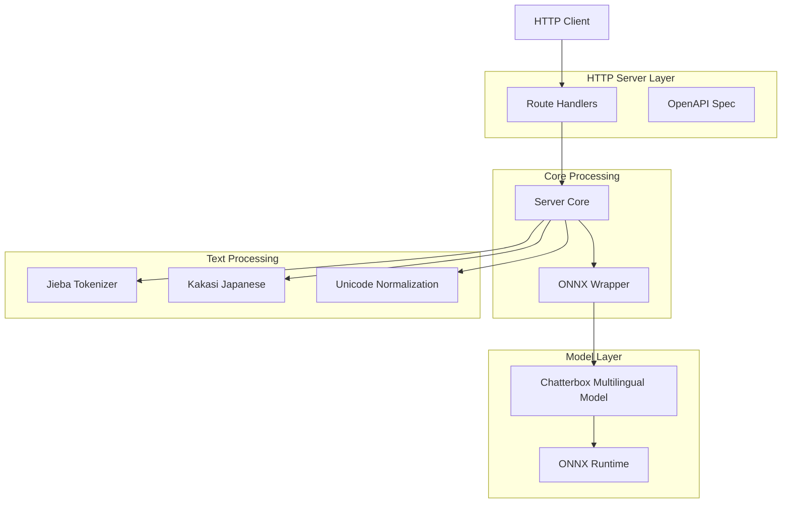

### 4. inventory - Model Catalog Service

**Technology**: Go  
**Type**: gRPC service for model metadata management

#### Architecture

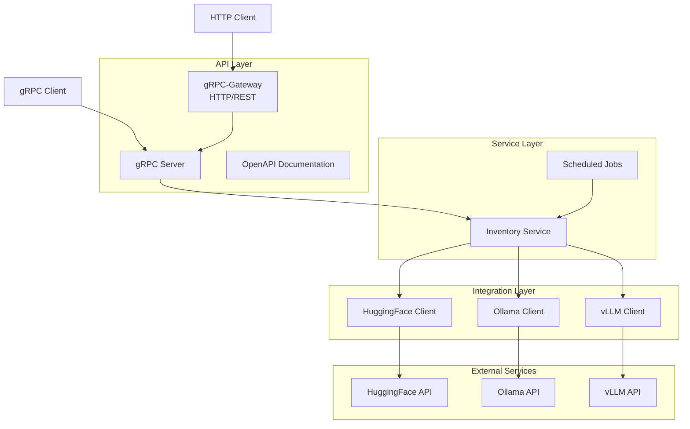

## Data Flow Diagrams

### AIRI Text-to-Speech Flow

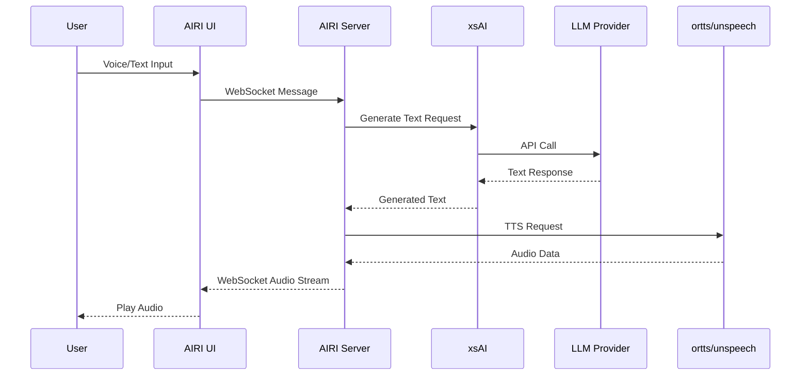

### Model Download & Catalog Flow

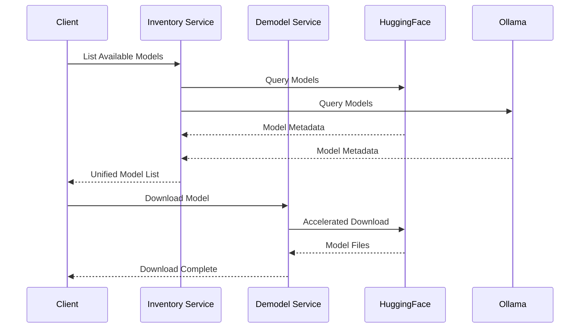

### Event-Driven Architecture (eventa)

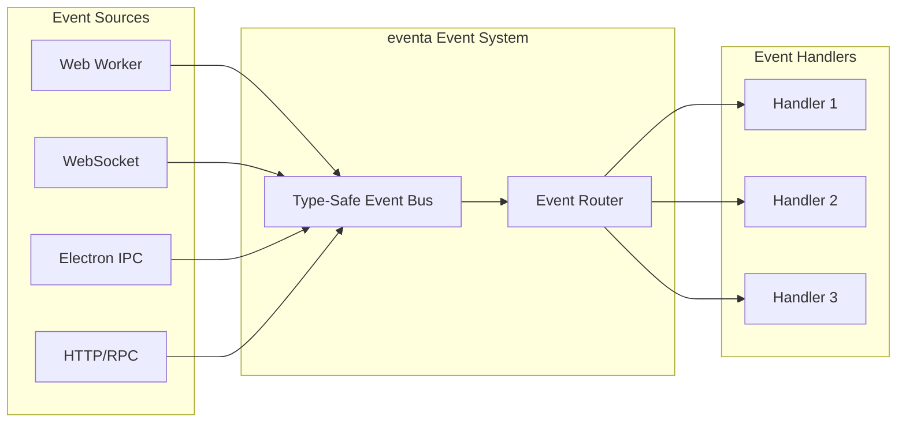

## Integration Boundaries

### External Service Integrations

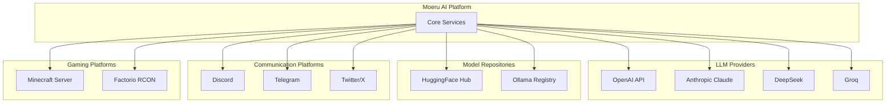

## Deployment Architecture

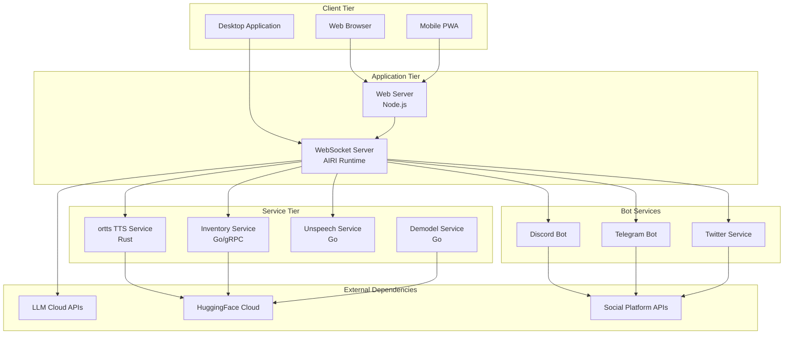

## Technology Choices and Rationale

### TypeScript/Node.js Projects
- **Rationale**: Rapid development, extensive ecosystem, web compatibility
- **Used for**: UI applications, SDK development, event systems
- **Key libraries**: Vue.js, Vite, Turbo (monorepo), pnpm (package management)

### Rust Projects
- **Rationale**: Performance, safety, native capabilities
- **Used for**: TTS inference server, Tauri desktop plugins
- **Key libraries**: Axum (HTTP server), ONNX Runtime, Tauri

### Go Projects
- **Rationale**: Excellent for network services, gRPC support, simplicity
- **Used for**: Microservices, API gateways, model management
- **Key libraries**: gRPC, Echo, Fx (dependency injection)

## Shared Infrastructure Components

### eventa - Event System
- Type-safe event-driven architecture
- Cross-boundary communication (Web Workers, WebSocket, IPC)
- Used across multiple projects for decoupled communication

### Standard Library (std)
- Shared standards and utilities for Moeru AI projects
- Common patterns and best practices

### MCP Launcher
- Model Context Protocol (MCP) server management
- Simplifies integration of MCP-compatible tools
- Docker-like experience for MCP servers

## Security Considerations

### Authentication & Authorization
- Token-based authentication in AIRI server runtime
- API key management for external services
- Secure credential storage

### Data Privacy
- Self-hosted option for complete data ownership
- Local model execution capabilities (via Ollama, Transformers.js)
- Minimal external API dependencies when using local models

### Network Security
- WebSocket secure connections (WSS)
- gRPC with TLS support
- Rate limiting and request validation

## Scalability & Performance

### Horizontal Scaling
- Stateless service design (inventory, unspeech, demodel)
- Load balancing ready for Go services
- Independent scaling of TTS and LLM inference

### Caching Strategy
- Model metadata caching in inventory service
- Audio output caching potential
- Response caching in xsAI SDK

### Performance Optimizations
- ONNX Runtime for efficient TTS inference
- WebGPU support for browser-based ML
- Parallel model downloads in demodel
- Turbo for efficient monorepo builds

## Development Workflow

### Monorepo Structure
- Independent project development
- Shared tooling and configurations
- Cross-project dependency management
- Unified version control

### Build System
- TypeScript projects: Vite, Turbo, tsdown
- Rust projects: Cargo workspaces
- Go projects: Go modules
- Per-project build scripts with monorepo orchestration

### Testing Strategy
- Unit tests per package
- Integration tests for service boundaries
- E2E tests for AIRI applications
- CI/CD pipeline considerations

## Future Architecture Considerations

### Potential Enhancements
- Kubernetes deployment manifests
- Service mesh for microservice communication
- Distributed tracing implementation
- Centralized configuration management
- Database layer for persistent storage
- Message queue for async job processing

### Extension Points
- Plugin system for AIRI extensions
- Custom provider support in xsAI
- Additional game integrations
- Enhanced RAG capabilities
- Multi-modal model support

## Conclusion

The Moeru AI monorepo represents a comprehensive ecosystem for AI-powered virtual companions and AI infrastructure. The architecture is designed for:

1. **Modularity**: Each project serves a specific purpose and can be used independently
2. **Interoperability**: Projects work together through well-defined interfaces
3. **Flexibility**: Support for both cloud and local execution
4. **Extensibility**: Plugin systems and provider abstractions allow easy extension
5. **Performance**: Use of efficient languages and runtimes where needed
6. **Developer Experience**: Modern tooling and clear project boundaries

The polyglot approach leverages the strengths of each language while maintaining clear separation of concerns and integration points.
