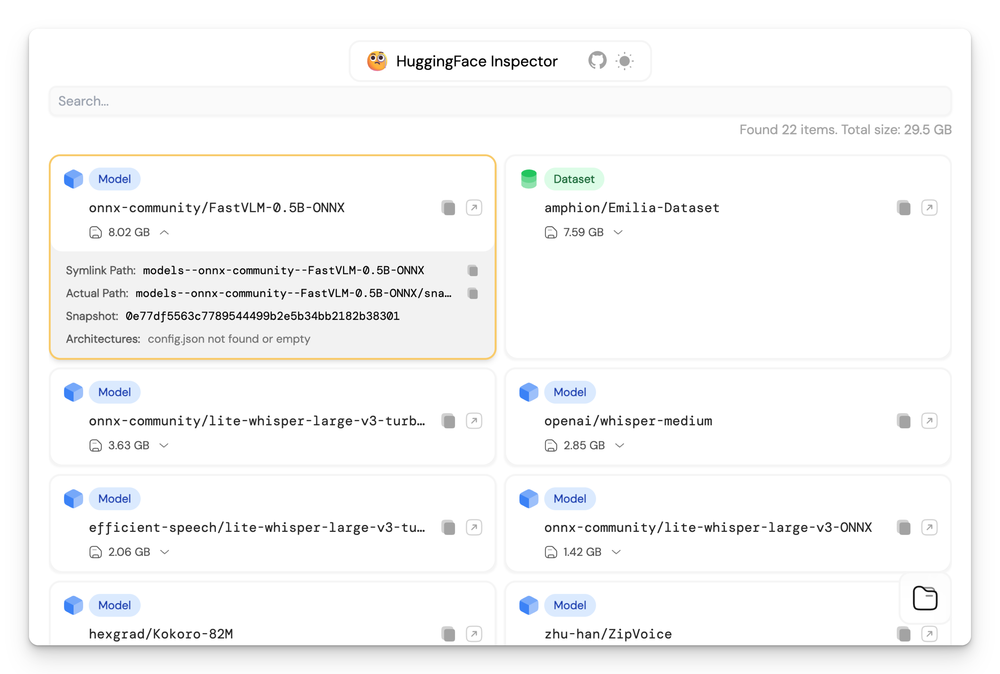

  <picture>
    <source
      width="850"
      srcset="./docs/public/screenshot-dark.png"
      media="(prefers-color-scheme: dark)"
    />
    <source
      width="850"
      srcset="./docs/public/screenshot-light.png"
      media="(prefers-color-scheme: light), (prefers-color-scheme: no-preference)"
    />
    
  </picture>

 

<h1 align="center">
  HuggingFace Inspector
</h1>

[[Try it](https://hf-inspector.moeru.ai/#/)]

## License

MIT
